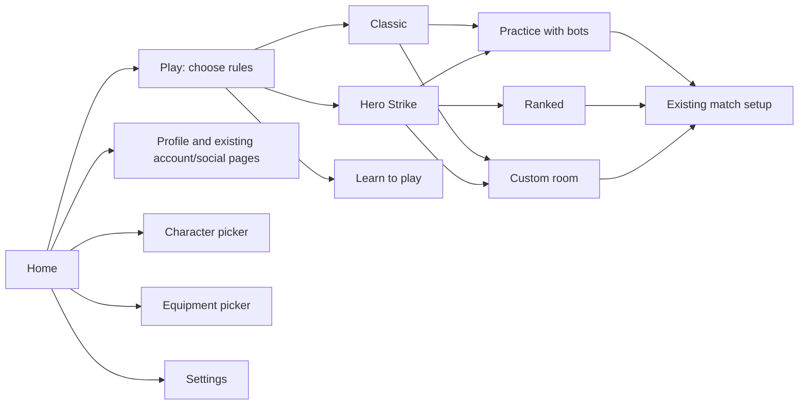

# UI placeholders and the supplied direction

Status: IMPLEMENTED, FINAL RUNTIME VERIFICATION DEFERRED at the user's request.
The girlfriend will remake the final UI art. These screens preserve useful flows,
replaceable art and clear interaction, rather than claiming final visual approval.

## References and decisions

The original reference is [TUMP.pdf](refs/ui/TUMP.pdf). Pages 1-7 establish the logo,
fonts, palette and materials; pages 20-26 are examples; pages 36-40 carry the strongest
composition and interaction direction. Original logo and slipper variants are beside
the PDF in `docs/refs/ui`. They are reference sources, not instructions to add shops,
currencies, battle passes or other systems from the example games.

The user wants English player-facing copy, calm navigation, a quirky Filipino
identity, sharp text and icons where their function is familiar. Proper character,
game and place names keep their identity. Back is an arrow; Close is a cross.
Meaningful choices such as Ranked, Custom Room and ability effects keep words.
Role and equipment instructions use defender, can and slipper. Rank/reward display
labels are English too; their saved identifiers and requirements remain unchanged.

The initial heavy red/pill controls and native-game menu recording were rejected.
So was a detailed realistic porch painting. The accepted direction follows the
actual street sketch: low view, foreground can and slipper, simple receding street,
bold imperfect contours, warm flat color and visible drawing. The illustrated
placeholder now has a background plate, separate tree and sun, and a full-image
fallback. It is not gameplay footage. A 14-second cycle gently sways the tree and
breathes the sun; the UI itself remains still.

## Actual navigation

Ranked remains the existing Hero Strike ladder. Entering the ranked destination
must not auto-host a LAN room. Custom rooms keep their existing hosting/joining
behavior. Profile, character and gear have direct home doors; the home picker
reuses the original picker component and a generated copy of its authored hierarchy.
No second inventory or account system was introduced.

The character maker is unavailable to players: its door is absent and its public
Open route refuses entry. Its code, models, saved data and editor/test authoring
route remain in the repository for a possible return.

## Loading

The illustrated loading screen displays for a randomly selected 5-15 seconds,
while the existing preload and account-readiness checks still run. It cannot leave
before actual readiness. Clicking the artwork opens an optional story/tip card;
reading keeps the screen open, the cross closes it and the arrow advances the text.
The provided slipper mark moves gently as the loading indicator. Internal preload
stage details are not printed as technical instructions to the player.

## Art and typography slots

- `Resources/UI/illustrations/street_key_art.png`: complete fallback illustration.
- `street_background.png`, `street_tree.png`, `street_sun.png`: aligned background
  and transparent motion layers. Keep their canvas proportions aligned. If either
  overlay or the clean plate is absent, the complete image is used instead.
- `Resources/UI/brand`: the team's existing logo, wordmark and slipper variants.
- `HomeAssetsAuthor.SavePickerFromMenu`: regenerates `Resources/UI/home/CharacterPicker.prefab`
  from the real MatchSetup picker after authored hierarchy changes.
- [FONT_USAGE.md](FONT_USAGE.md): Darumadrop display, Kawit Extended accents and
  Lydian reading text. Their imports include dynamic font data and preserve sharp
  rendering at requested sizes. Lydian's signed descent was corrected without
  changing letterforms; owner embedding permission is recorded there.

`StreetGraphic`, `StreetIcon` and `StreetUi` are replaceable placeholder surfaces.
`NavigationSymbol` preserves the existing button callback and target rectangle,
so discard handling and controller navigation continue to use the original paths.
Settings keeps its existing pages and adds Low/Balanced/High graphics quality.

## Verification boundary and next check

Earlier stages passed Core 559/559, EditMode 446/446, the isolated result-input
sweep 5/5 and focused HomeFlowTests 2/2. All editor checks and gating source audits
also passed before the final illustration/loading changes. Those results are
historical checkpoints, not verification of the final working tree.

The user then explicitly requested no further tests and no player build in this
chat. Final illustration/loading integration received static review only. Next:
run the home/settings/profile/gear/back journeys, both rules branches, ranked and
custom entry, animated layers, loading duration/readiness, story open/next/close,
and return/reload with mouse and controller. Check 1280x720, short wide, 4:3 and
ultrawide, including the longer defender captions and rank/reward labels. Re-run
the screen and input-surface groups, resolve real failures, and
build/launch the exact Windows player. Do not cite an old screenshot as a final render.
