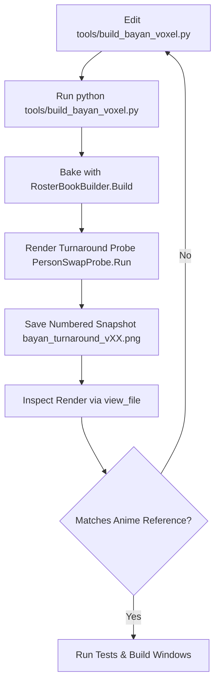

# Bayan (Earth Warrior) — Character Specification & Autonomous Iteration Guide

## 1. Overview & Inspiration
- **Character Name**: Bayan (Earth / Rock Warrior)
- **Role / Element**: Earth Defender in *Tumbang Preso*
- **Visual Reference**: **Kawaki (Karma / Otsutsuki Horn Form)** from Boruto.
- **Reference Assets**:
  - `C:/Users/matth/.gemini/antigravity/brain/f417c176-4c46-4fa7-aec0-a7adb0ac171e/.user_uploaded/media_1787164220119.png` (Kawaki Face Slash, Karma Eye, Temple Horn)
  - `C:/Users/matth/.gemini/antigravity/brain/f417c176-4c46-4fa7-aec0-a7adb0ac171e/.user_uploaded/media_1787164289261.png` (Karma Arm Tattoos, Horn Ridge Bands)
  - `C:/Users/matth/.gemini/antigravity/brain/f417c176-4c46-4fa7-aec0-a7adb0ac171e/.user_uploaded/media_1787164331901.png` (Forearm Diamond Spear Mark)
- **Latest In-Engine Turnaround Renders**:
  - `C:/Users/matth/.gemini/antigravity/brain/be6748f6-4786-45ad-a025-9f0dab250e3a/bayan_turnaround_v22.png` (Current: Tapered Bare Arm, Fierce Slanted Eyes, Stoic Expression, Backward Curved Horn)
  - `C:/Users/matth/.gemini/antigravity/brain/f417c176-4c46-4fa7-aec0-a7adb0ac171e/bayan_turnaround_v21.png` (Prior baseline)

---

## 2. Visual Design & Key Features

### A. Head, Face & Otsutsuki Horn
1. **Otsutsuki Rock Horn (`+X` Left Temple)**:
   - 3-tier backward-curving stone horn emerging from shaved left temple and sweeping dynamically along the skull contour (`z: 0.045 -> -0.170`, `y: 0.530 -> 0.765`).
   - 3 crimson Karma ridge bands (`#8e2b1d`) wrapping diagonally around each horn tier.
2. **Karma Facial Slash & Brow**:
   - Bold diagonal crimson Karma slash (`#8e2b1d`) constructed as discrete convex quads slicing from the high forehead down through the left eyebrow, wrapping tightly around the Karma eye socket, and tapering across the cheek down to the jawline.
   - Connected neck Karma streaks (`karma-neck-slash` & `karma-neck-branch`) streaming down from jawline across the left collarbone.
   - Left eyebrow is cleanly split by the scar into inner and outer segments.
3. **Heterochromia Anime Eyes & Intense Glare**:
   - **Right Eye (`-X`)**: Determined hooded ocean blue anime iris (`#3b8ec8`) with white sclera, dark pupil, white glint sparkle, lower lash rim, and sharp slanted upper dark eyelash line (`#1a1420`).
   - **Left Eye (`+X`)**: Radiant glowing golden Karma eye (`#ffd700`) with white sclera, sharp dark vertical pupil slit, glowing hot white core, and upper eyelash rim.
   - **Fierce Brow**: Heavy dark brows angled steeply downward into the nose bridge for an aggressive anime warrior glare.
4. **Hair & Undercut**:
   - Spiky charcoal black quiff / fauxhawk (`#1a181e`) covering the crown and forehead bangs.
   - Shaved dark brown fade undercut (`#482f1d`) beneath the horn on the left temple.
5. **Mouth & Jewelry**:
   - Stoic, tight warrior mouth line (`#1a1420`) with subtle downturned corners and underlip shadow notch.
   - Silver stud earrings (`#d4e2ec`) fitted cleanly on both earlobes.

### B. Bare Muscular Left Arm with 360° Karma Tattoos
- **Left Arm (`+X`)**: Bare bronze warrior skin (`SKIN_LIT`: `#a8602c`) with smooth continuous anatomical tapering across deltoid, bicep, forearm, and wrist (no stepped sleeve cuff/collar ledge).
- **360° Crimson Karma Tattoos (`#8e2b1d`)**:
  - **Deltoid / Shoulder**: Circular Karma sun sphere tattoo.
  - **Bicep / Tricep**: Curved flame tendrils streaming down front and back.
  - **Forearm**: Triangular Karma spear arrowhead with radiant gold core (`#dfb248`) on both front and back.
  - **Hand**: Circular Karma seal on palm and back of hand.

### C. Body, Robe & Outfit
- **Right Arm (`-X`)**: Warm dark brown warrior sleeve with radiant gold wrist cuffs.
- **Robe**: Forest green robe (`#3d6335`) with crossed gold chest sashes and flared standing collar.
- **Belt & Buckle**: Double-tier brown leather belt with radiant gold plate and glowing emerald/jade gem medallion (`#38b848`).
- **Cape**: Forest green back cape draped with gold border trim and a centered gold Earth elemental diamond rune.
- **Legs & Boots**: Dark brown leather combat pants, knee pads, and forest green combat boots with white sole treads and gold buckle straps.

---

## 3. Mandatory Autonomous Iteration Loop

Incoming agents working on this character MUST follow this iterative feedback loop:



1. **Modify Geometry/Features**: Edit `tools/build_bayan_voxel.py`.
2. **Re-build & Ingest**:
   ```powershell
   python tools/build_bayan_voxel.py
   $p = Start-Process -FilePath "C:\Program Files\Unity\Hub\Editor\6000.5.8f1\Editor\Unity.exe" -ArgumentList "-batchmode -quit -projectPath . -executeMethod TumbangPreso.EditorTools.RosterBookBuilder.Build -logFile Logs/roster-build.log" -Wait -PassThru ; $p.ExitCode
   ```
3. **Render Turnaround, Archive Snapshot & Inspect**:
   ```powershell
   $p = Start-Process -FilePath "C:\Program Files\Unity\Hub\Editor\6000.5.8f1\Editor\Unity.exe" -ArgumentList "-batchmode -quit -projectPath . -executeMethod TumbangPreso.EditorTools.PersonSwapProbe.Run -logFile Logs/probe-run.log" -Wait -PassThru ; $p.ExitCode
   # Archive incremented iteration render
   Copy-Item -Path "Logs/person-swap-turnaround.png" -Destination "C:\Users\matth\.gemini\antigravity\brain\be6748f6-4786-45ad-a025-9f0dab250e3a\bayan_turnaround_v<NUM>.png" -Force
   Copy-Item -Path "Logs/person-swap-turnaround.png" -Destination "C:\Users\matth\.gemini\antigravity\brain\be6748f6-4786-45ad-a025-9f0dab250e3a\bayan_turnaround_latest.png" -Force
   ```
   - **Always call `view_file`** on the copied image to self-critique the 4-angle turnaround against the Kawaki reference art!
4. **Iterate autonomously** until all features look cohesive, aggressive, and high quality.
5. **Run Full Verification**:
   - `dotnet test Core.Tests/TumbangPreso.Core.Tests.csproj`
   - Unity EditMode tests
   - Build Windows standalone executable (`GameBuilder.BuildWindows`)
