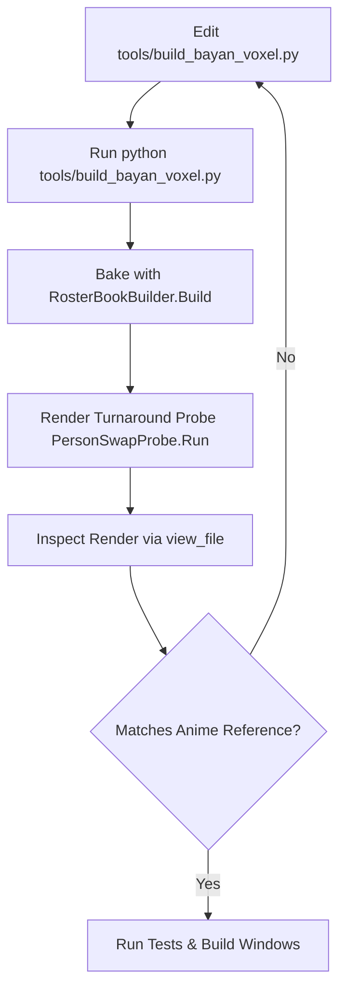

# Bayan (Earth Warrior) — Character Specification & Autonomous Iteration Guide

## 1. Overview & Inspiration
- **Character Name**: Bayan (Earth / Rock Warrior)
- **Role / Element**: Earth Defender in *Tumbang Preso*
- **Visual Reference**: **Kawaki (Karma / Otsutsuki Horn Form)** from Boruto.
- **Reference Assets**:
  - `C:/Users/matth/.gemini/antigravity/brain/f417c176-4c46-4fa7-aec0-a7adb0ac171e/.user_uploaded/media_1787164220119.png` (Kawaki Face Slash, Karma Eye, Temple Horn)
  - `C:/Users/matth/.gemini/antigravity/brain/f417c176-4c46-4fa7-aec0-a7adb0ac171e/.user_uploaded/media_1787164289261.png` (Karma Arm Tattoos, Horn Ridge Bands)
  - `C:/Users/matth/.gemini/antigravity/brain/f417c176-4c46-4fa7-aec0-a7adb0ac171e/.user_uploaded/media_1787164331901.png` (Forearm Diamond Spear Mark)
- **Latest In-Engine Turnaround Render**:
  - `C:/Users/matth/.gemini/antigravity/brain/f417c176-4c46-4fa7-aec0-a7adb0ac171e/bayan_turnaround_v21.png`

---

## 2. Visual Design & Key Features

### A. Head, Face & Otsutsuki Horn
1. **Otsutsuki Rock Horn (`+X` Left Temple)**:
   - Single curved stone horn growing from the shaved left temple behind the face plane (`z: -0.110 -> -0.005`, `y: 0.560 -> 0.765`).
   - 3 crimson Karma ridge bands (`#8e2b1d`) wrapping diagonally around the horn.
2. **Karma Facial Slash & Brow**:
   - Bold diagonal crimson Karma slash (`#8e2b1d`) slicing from the high forehead down through the left eyebrow, wrapping around the eye socket, and tapering across the cheek.
   - Left eyebrow is split by the scar into inner and outer segments.
3. **Heterochromia Anime Eyes**:
   - **Right Eye (`-X`)**: Determined ocean blue anime iris (`#3b8ec8`) with white sclera, dark pupil, white glint sparkle, and sharp slanted upper dark eyelash line (`#1a1420`).
   - **Left Eye (`+X`)**: Radiant glowing golden Karma eye (`#ffd700`) with white sclera, dark vertical pupil slit, glowing hot white core, and upper eyelash rim.
4. **Hair & Undercut**:
   - Spiky charcoal black quiff / fauxhawk (`#1a181e`) covering the crown and forehead bangs.
   - Shaved dark brown fade undercut (`#482f1d`) beneath the horn on the left temple.
5. **Mouth & Jewelry**:
   - Confident slight warrior smirk (`#1a1420`).
   - Silver stud earrings (`#d4e2ec`) on both earlobes.

### B. Bare Muscular Left Arm with 360° Karma Tattoos
- **Left Arm (`+X`)**: Bare bronze warrior skin (`SKIN_LIT`: `#a8602c`).
- **360° Crimson Karma Tattoos (`#8e2b1d`)**:
  - **Deltoid / Shoulder**: Circular Karma sun sphere tattoo.
  - **Bicep / Tricep**: Curved flame tendrils streaming down front and back.
  - **Forearm**: Triangular Karma spear arrowhead with radiant gold core (`#dfb248`) on both front and back.
  - **Hand**: Circular Karma seal on palm and back of hand.

### C. Body, Robe & Outfit
- **Right Arm (`-X`)**: Warm dark brown warrior sleeve with radiant gold wrist cuffs.
- **Robe**: Forest green robe (`#3d6335`) with crossed gold chest sashes and flared standing collar.
- **Belt & Buckle**: Double-tier brown leather belt with radiant gold plate and glowing emerald/jade gem medallion (`#38b848`).
- **Cape**: Forest green back cape draped with gold border trim and a centered gold Earth elemental diamond rune.
- **Legs & Boots**: Dark brown leather combat pants, knee pads, and forest green combat boots with white sole treads and gold buckle straps.

---

## 3. Mandatory Autonomous Iteration Loop

Incoming agents working on this character MUST follow this iterative feedback loop:



1. **Modify Geometry/Features**: Edit `tools/build_bayan_voxel.py`.
2. **Re-build & Ingest**:
   ```powershell
   python tools/build_bayan_voxel.py
   $p = Start-Process -FilePath "C:\Program Files\Unity\Hub\Editor\6000.5.8f1\Editor\Unity.exe" -ArgumentList "-batchmode -quit -projectPath . -executeMethod TumbangPreso.EditorTools.RosterBookBuilder.Build -logFile Logs/roster-build.log" -Wait -PassThru ; $p.ExitCode
   ```
3. **Render Turnaround & Inspect**:
   ```powershell
   $p = Start-Process -FilePath "C:\Program Files\Unity\Hub\Editor\6000.5.8f1\Editor\Unity.exe" -ArgumentList "-batchmode -quit -projectPath . -executeMethod TumbangPreso.EditorTools.PersonSwapProbe.Run -logFile Logs/probe-run.log" -Wait -PassThru ; $p.ExitCode
   Copy-Item -Path "Logs/person-swap-turnaround.png" -Destination "C:\Users\matth\.gemini\antigravity\brain\f417c176-4c46-4fa7-aec0-a7adb0ac171e\bayan_turnaround_latest.png" -Force
   ```
   - **Always call `view_file`** on the copied image to self-critique the 4-angle turnaround against the Kawaki reference art!
4. **Iterate autonomously** until all features look cohesive, aggressive, and high quality.
5. **Run Full Verification**:
   - `dotnet test Core.Tests/TumbangPreso.Core.Tests.csproj`
   - Unity EditMode tests
   - Build Windows standalone executable (`GameBuilder.BuildWindows`)
