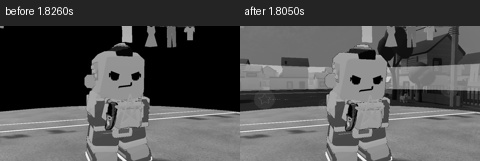
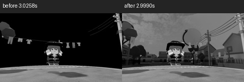
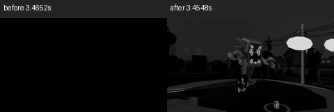
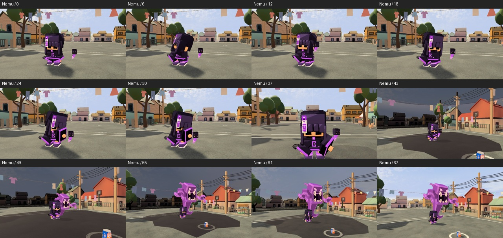
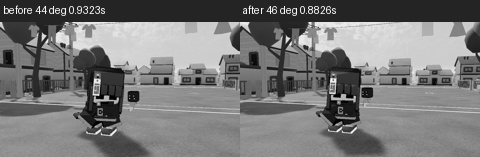

# First local cloud repairs, 2026-09-24

Later native screen follow-up: the cloud skill tree's real HOME door and BACK
route passed before and after a small player-facing copy correction, at five
viewport shapes. [Skill-tree report](skill-tree/report.md). Physical input and
account integration remain separate gates.

Owner confirmed the push; ASTRAReworks fast-forwarded to4f62fcc5c. This review
takes priority over the previous map/bot/final queue, which remains intact.
The incoming last commit already removed generated hero voices. Human recordings
remain an external asset requirement, not permission to regenerate synthetic audio.

## Runtime and visual defects fixed

1. **Introduction warm-up asserted before the performance could play.** The first
   native run passed2/7; five cases failed at GroundIntroduction's SetCurve call.
   Clearing x/y/z bindings before replacement did not fix it; that failed attempt
   is retained. The actual fix samples the original authored clip to calculate
   support, then constructs a fresh unsampled legacy clip with those root curves
   present from creation. ClipBuilder retains original rotation/punch curves;
   authored timing and levitation are unchanged. The temporary clip is disposed.
   This resolves the observed Unity6000.5 failure; no internal engine-cause claim
   beyond the reproduced sampled-clip mutation is needed.
2. **All stage walls turned black.** WallMesh still wound opposite triangles over
   the same vertices, cancelling their normals. The earlier cloud TwoSided fix
   did not cover this independent mesh builder. WallMesh now produces one surface
   then uses that corrected helper to create separate back-face vertices/normals.
   The designed dusk/storm/ink/ice/sea colors and translucency are visible in native
   captures. No global shader/lighting restyle or map material change.
3. **Nemu put her held slipper through her face.** The first working native study
   counted65intersecting shoe vertices. Her new held variant keeps the actual shoe
   by her outside hip and sends Kuro with the free hand that offered his nuzzle.
   The empty-hand performance, body model, grip data, timing and other heroes are
   retained. The table comes from author_ultimate_intros.py, not a manual patch.

## Evidence

- `native-baseline.xml`:2/7, actual grounding assertions.
- `grounding-clear-binding-failure.xml`:1/7, rejected first hypothesis.
- `grounding-fixed-nemu-contact-failure.xml`: clip assertion resolved; study
  reached Nemu and exposed the genuine held-equipment intersection.
- `introduction-study.xml`: **1/1 in33.3963163s**, all seven heroes. Net ground
  clearance stays within1.9mm; zero held-shoe/head intersections for all seven.
- `shared-phase.xml`: **6/6 in73.5436033s**, same corrected source. Existing cases
  cover actual live activation, shared two/four-caster timing, second cohort
  cleanup, retained Nemu reveal, blocked-shot fallback, reduced view and round
  cancellation. These are local native PlayMode cases, not real-peer proof.
- Core HeroLines **7/7**, HeroLoadout **14/14**, separate TRX. The initial filter
  `Phase10Tests` matched no class because the file's class is HeroLoadoutTests;
  the second focused run covers the actual class. No full-Core claim.

Actual twelve-sample native sheets were inspected for every hero. Four available
before sequences and all seven after sequences are retained. Detail comparisons
use the same authored camera path at the nearest recorded times, explicitly
labelled in the25percent greyscale pairs; they are not pixel-identical frame times.
All raw captured frames/CSV remain in QUAL Logs/cloud-intake-visual-v3 and-v4.
This is frame-sequence inspection, not claimed continuous video/audio playback.

## Visual critique and next work

The bug fixes make the performances render, but do not finish the artistic review.
Sean's parol is too similar in color/value to his body in the gather close shot;
its thin orange frame and bright horizon compete instead of making the craft the
focus. Review his lantern separately. Phaister's lift and eclipse now read, but
her wide shot makes her small; judge it in the real overlay before changing its
composition. Nemu's growing companion remains visible after the wall fix, with
very dark ink at the peak; reduced/observer framing still needs its own evidence.
Zack's storm, Dante's divided ridge, Cheska's cold stage and Rafi's wave now have
distinct visible forms. Their incoming art is retained pending individual critique.

The incoming Nemu16m stage and fit-camera work were preserved during merge.
The original 4:3 check failed by0.00077 of the viewport in the opening shot.
Changing the later fit-camera factor did not address that shot; restoring the
incoming factor and widening only the authored opening lens44 to46 degrees passed
the focused native case **1/1 in9.2232001s**. The full native sequence and
25percent grey pair were inspected. This was a marginal crop, so further framing
tests here would take time from higher-impact product work.

Next fix the separately observed first-person throw grip and Bayan right pektus
head intersections recorded by NATIVE-CHECK-1. Then per-hero visual refinement,
live Grand Coven/body/FPP cast review, tree UI and missing-recording behavior.
The remaining world-skill work and final native/peer/performance/device gates
are still open. No intermediate player build was made.

Client duration currently depends on local kits before those kits are confirmed
ready. This is a source-level peer concern, not a reproduced desync. Investigate
it at the peer gate; do not change the protocol speculatively during art repair.

Unity jobs finished; generated churn backed up/restored. Protected DEV PNG metas
remain untouched. No new browser/helper was opened for this unit. No fixture
repair or assertion suppression was used; repeated runs followed actual product
defects and changed implementation rather than attempts to manufacture a pass.
