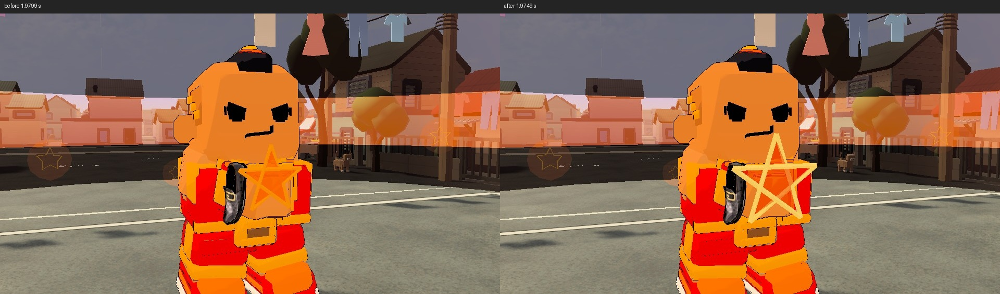
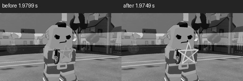

# Sean's crafted parol, 2026-09-24

In the pushed ultimate introduction, Sean built a five-stick parol between his
hands. The actual close shot showed it in nearly the same orange value as his
costume and bright horizon; in 25 percent greyscale the frame largely vanished.
The shape and story were already strong, so this local change keeps the five
sticks, authored gesture, camera, timing and live Flame Rush handoff.

The frame now sits slightly in front of his chest, grows from0.23m to0.30m,
uses pale warm sticks of0.016m width, and carries a darker ember center. This
gives the craft a distinct light outline over his red/orange chest without an
extra flash or a wider gameplay effect. His face stays unobstructed.

The existing guarded native introduction study passed **1/1 in32.88192s**.
Its Sean shot at1.9799s before and1.9749s after uses the same authored camera.
Both full-color frames and exact 25 percent greyscale thumbnails were inspected:
the original thin orange form blends into the shirt; the pale five-stick shape
remains legible at thumbnail size after the edit. This is one retained local
variant, with no change to other heroes, rules, models or shared shaders.

Raw sequences, XML and generated-churn backups stay in QUAL Logs. Continuous
playback, caster/observer/peer comparisons and final all-hero acceptance remain
open in REFINE-2.11/P7. No intermediate player build was made.
