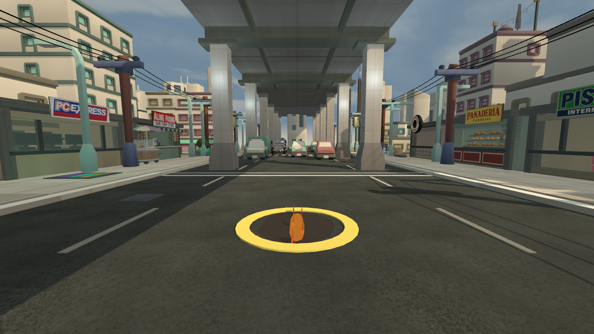
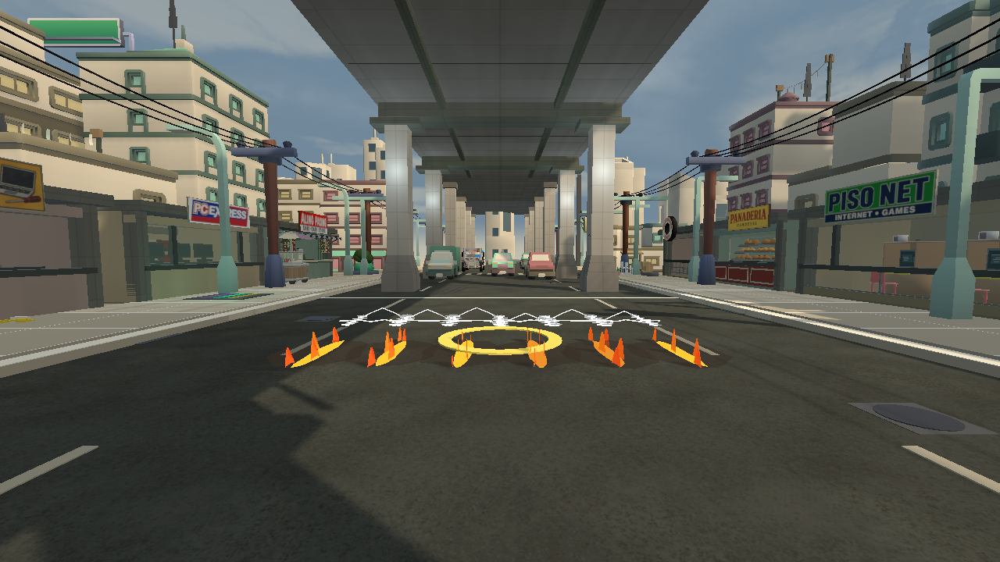
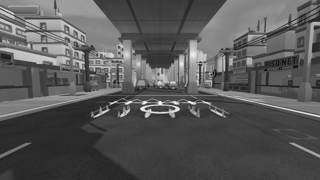

# Flame Rush: current trail read, 2026-09-25

The pushed cloud branch already strengthened Sean's fire trail with a taller
tongue and ember core. `AbilityShowcaseProbe` v59 rendered the actual current
hazard builder in Ilalim ng Tulay. The single drop is small and intentionally
does not imitate Supernova. Across the six-drop corridor, separated upright
flames form a forward route, with orange heat against the darker road. The
can, court line and nearby street context remain visible at the eye camera;
the shape persists at25percent greyscale. A solid unbroken fire plate would
suggest damage in the gaps between the game's bounded hazard drops, so the
existing separation is useful information, not a texture gap to cover.

**Decision: retain the current world geometry.** No Flame Rush source changed.
The staged editor images cannot prove the live cast tell, step timing, sound,
multi-ability overlap or network playback. Those remain in SKILL-FX-1/P7.
The probe exit0 establishes only that its render set completed under the
built-in whiteout bound, not that the whole skill is artistically approved.

