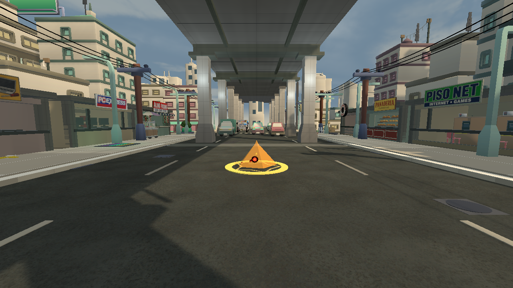
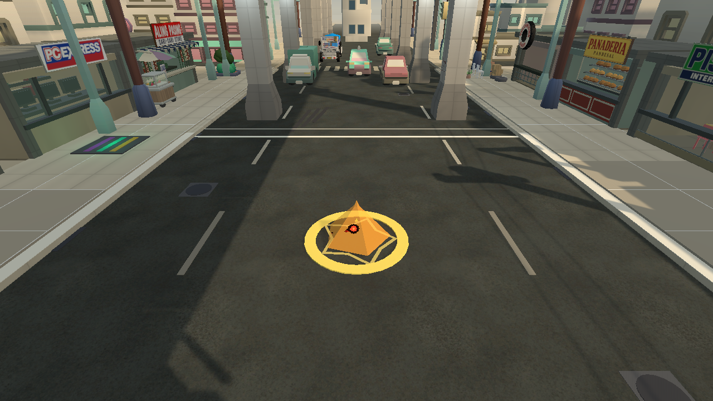
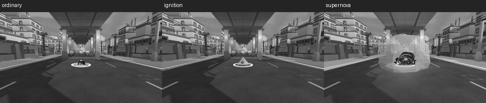

# Ignition Cannon impact, 2026-09-25

The cloud skill plan asks Sean's charged slipper to land with its own
five-point fire signature. Source review corrected an initial mistaken label:
the staged4.8m orange dome is Supernova. Ignition Cannon was routed through
the same beige-smoke, six-point `ExplosionStyle.Slipper` as an ordinary throw.
The v59 ordinary impact and current Supernova were inspected in the native
Ilalim camera before changing the impact.

The charged slipper now chooses a separate Ignition presentation in the
existing ExplosionLook seam. A five-point warm outline reaches its actual2.6m
impact radius; a short five-sided ember rises below player height with a small
existing BoltHead glow and five restrained pieces. It has no large translucent
dome. Ordinary slippers keep their small smoke and Supernova keeps its larger
shell. Ignition retains knockback13, stun1.4, **neutral** stun element and the
physical slipper-impact sound. Its Cannon cast already has a distinct cue.
No hitbox, authority, score, input, network format or resource cost changed.

The same guarded Editor showcase captured three local ideas at the same eye
and overhead cameras: v60's ground outline with a near-invisible center;
v61's readable short ember; v62's tapered tongue and v63's enlarged tongue,
both thinner at play height. **The v61 shape was selected.** The final source
uses that runtime shape; the capture filename version is reserved as v64 so a
future capture cannot overwrite the selected and rejected images. There was
no fourth art candidate. Each run exited0 with the showcase's whiteout gate.
Actual color and25percent greyscale were inspected against the staged ordinary
slipper and Supernova. The can, court and background remain visible. The
ordinary staged sample uses2.2m while the charged skill uses2.6m, so the
comparison concerns visual role rather than identical reach.

The raw v59-v63 images and generated-churn backups remain in QUAL Logs. One
accidental unchanged-source v59 authoring launch occurred when known generated
settings churn blocked a source copy; the diff was saved and the intended
source was byte-checked before v60. Only v60-v63 informed the art choice.

This is a local staged impact correction, not the whole Cannon skill. The held
slipper, flight and accepted throw; full-speed caster, opponent and spectator
views; sound in the real mix; Low/reduced-effects readability and peers remain
open. Other world-skill effects remain in SKILL-FX-1. Next is Supernova's larger
dome, which needs a readable live overlap before changing it from a still.

Riot's [VALORANT clarity account](https://www.riotgames.com/en/news/valorant-shaders-and-gameplay-clarity)
discusses readable effects across graphics tiers; this local impact keeps its
essential shape independent of a flash while fitting TUMP's blocky art.
