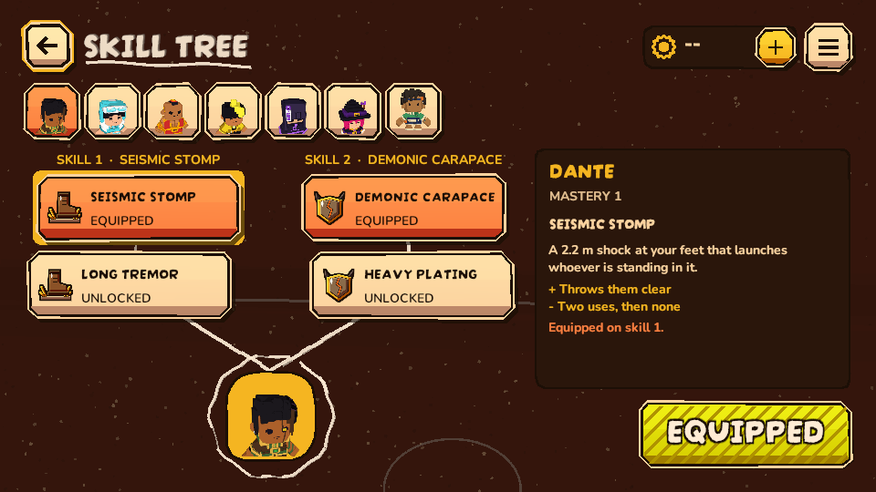

# Skill tree native HOME route

The cloud unlock switch makes every alternate skill available during testing.
The actual HOME to SKILL TREE button and BACK path passed in the guarded
Windows Editor, **1/1 before** in 42.053 s and **1/1 after** in 36.207 s.
Core HeroLoadoutTests also passed 14/14 for the rule selection; they do not
replace this screen check.

Before, the mastery header told players "every branch open for testing" even
though each open tile already says UNLOCKED. The after source keeps the mastery
level and removes that internal explanation in open mode. When challenge locks
are enabled again, its useful unlock instruction stays. No skill state, equip
control, counters or networking changed.

The existing PlayMode door fixture captured the screen at 960x540, 1280x720,
1280x960, 1600x680 and 1920x1080. Actual images were inspected for tile text,
selected detail, controls, bounds and background. The 960x540 and 1600x680
before/after pairs also have 25 percent greyscale thumbnails. The controls fit
the tested sizes; no observed overlap or clipping. This is an Editor canvas
result, not a claim of physical pad/touch operation, server progression,
purchases or deployed wallet behavior.

Further gates remain in TODO: `LoadoutSurfaceProbe`, `TumpNativePickerTests`,
physical pad and touch, and account integration.
