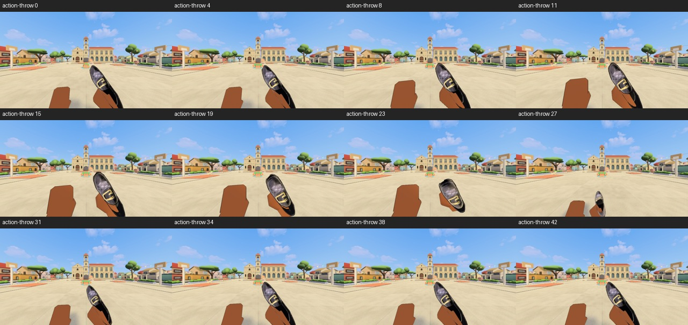
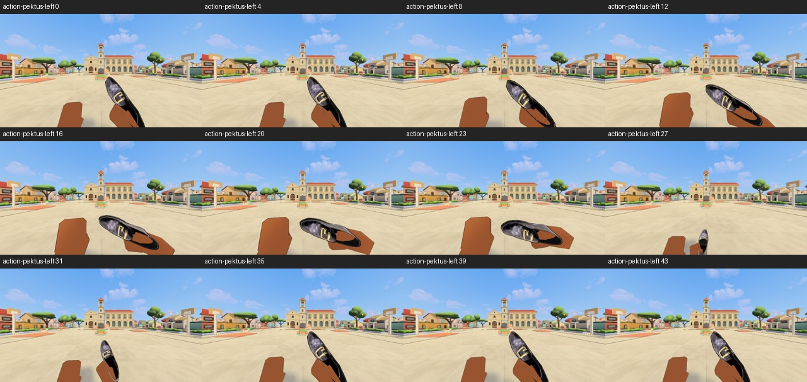
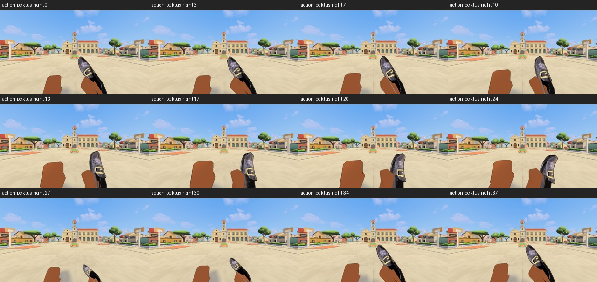
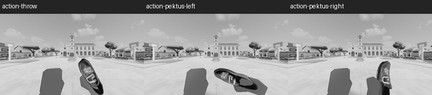

# Actual throw clearance, 2026-09-24

The first-person charged slipper swung close to the eye. The current source's
straight pose placed its fingertip0.082m from the camera; the two curve poses
were also near the limit. `ApplyThrowReach` anchored the parent pivot and then
rotated it, while the carried shoe follows the pivot's rotating Arm child.
The correction measures that child's fingertip after the arm and wrist pose,
then offsets the pivot to keep the grip near the established `CarryAnchor`.
Straight, left and right charges still have distinct short screen travel and
wrist roll. The release, cancel and gameplay throw path are unchanged.

The focused EditMode grip checks failed3/3 before and passed **3/3 in0.211s** after
the actual fingertip correction, with the original depth, height and distance
assertions. Two intermediate product attempts are retained: a simple offset
restored depth but dropped the hand below frame; a pivot-based anchor missed the
rotated child fingertip. Neither was a fixture change. The native
`GameplayActionShots.ThrowAndBothPektusInBothViews` then passed **1/1 in20.399s**.
Its owner views show the whole slipper during straight, left and right charge,
distinct roll/direction cues, and a clear court through release. The court-side
right-pektus view retains the body pose. The 25 percent greyscale thumbnails were
inspected. These are sampled normal-speed frames, not a claim of continuous
playback or human feel approval.

## Body-throw result and conflicting fixture

The incoming EditMode `ThrowEquipmentClearanceTests` reported every one of its
190person/equipment pairs entering the rigid head, usually at35percent charge
and right spin1. This was a broader synthetic finding than its first Bayan rows
suggested. Before changing the body animation, the existing real-input PlayMode
review filmed Bayan's quick, left and moving-right throws at spin.75. It passed
with **0 shoe vertices inside the head across98 charged samples** in the moving
right case. A single scoped boundary check used actual Bayan/alpombra and legal
spin1; it passed **1/1 in19.531s**, **0 of41696 vertices inside the head across92
charged samples** in the moving-right case. The observed body frames kept the
shoe clear of the head. The opt-in spin input was added to the existing review
probe; its default remains .75. No shared body motion was altered.

The EditMode result conflicts with these live-input measurements. It stays red
and is **not** marked as a product pass or silently ignored. Its synthetic setup
must be reconciled with real equipped slipper placement during final candidate
qualification. It does not justify weakening the assertion or changing a healthy
body throw now. Other cast/skin combinations and actual network observers remain
separate open gates.

The original failure XML/CSV, both live PlayMode XMLs, the after XML and selected
normal-speed frame sheets are preserved here. Full raw frames/CSVs stay in the
qualification workspace's Logs. No broad regression or intermediate player
build ran for this unit. Known Unity-generated asset churn was backed up before
restoration; the two protected DEV PNG metas remain untouched.
