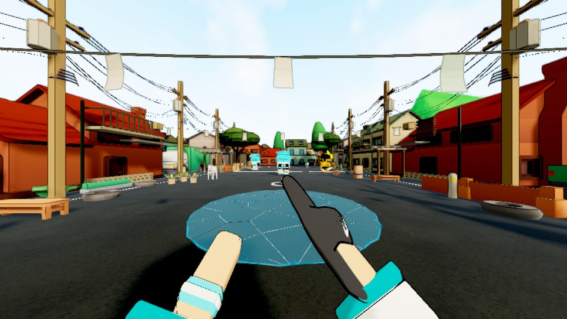
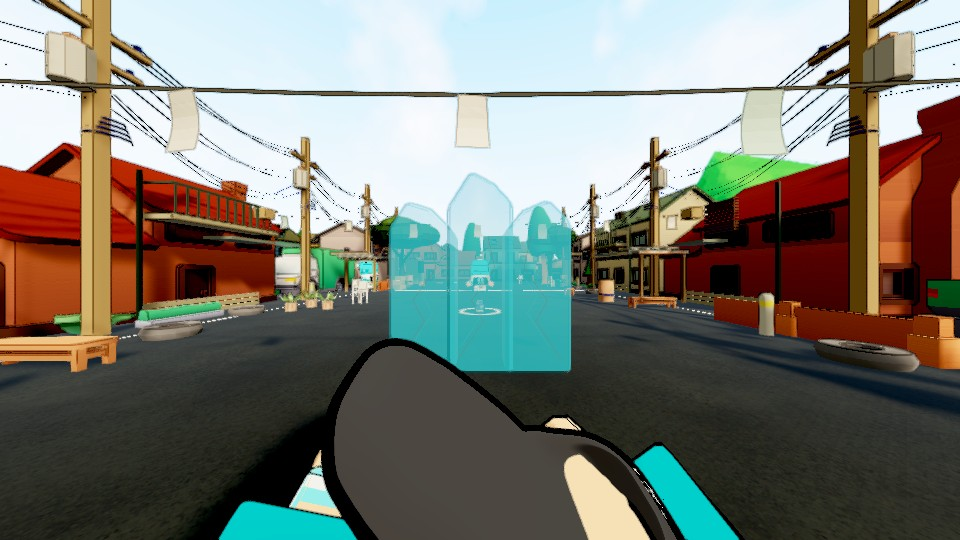
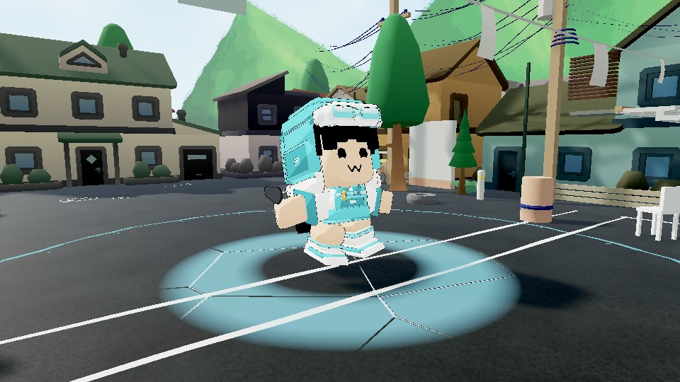

# Cheska kit refinement, 2026-09-10

The sheet is now a thin fractured surface fitted to the actual street. It stays
fixed at kerbs and reduces traction as well as speed. A dry/ice stopping comparison
measured 0.0000 m versus 0.2163 m of drift after input release. The owner remains
immune; overlapping sheets release independently. Combat impulse friction and the
authored retrieval slide are unchanged.

The barricade uses three separately drawn Blender slabs with the same mesh for
visible geometry and convex collision. It has no detached diamond toppers or
permanent cyan light. Expiry disables collision immediately and emits only small
nonphysical fragments. Frozen victims retain a visible face and torso, and their
low restraint breaks when the actual ice status ends, including mash-out.

Nova gathers small cold fragments during its existing windup and releases a short
radial front to its actual radius. The generic nine-metre cylinder and its light
are absent from Cheska's path. Her wall/nova clips have less extreme backbend and
body scaling. Held placement now prepares the FPP hands; accepted release continues
the gesture, while interruption and throw charge retain their priority.

Seven sound layers were shortened and filtered around preparation/contact/thaw.
The wall cast's peak moves from .866 to .156 seconds; nova preparation ends at its
.4-second windup and its payload peaks .011 seconds after release. Peak/RMS budgets
are lower than their inputs. Sources are the baked recorded/synthesised cues at
`a275138`; `tools/refine_cheska_audio.py` is reproducible from that checkpoint.
This is signal and timing verification, not listening approval.

Verification:

- Refreshed EditMode: 478/478, including FPP preparation/cancellation at 30/60/144 FPS.
- Actual three-cast and collision/ground/escape review: 6/6.
- Subsequent live traction, overlap, immunity and one-second kerb check: 4/4.
- Checks.RunAll: all eight pass. All fourteen gating source audits pass; the
  informational audio audit retains seven flags across 119 files.
- Source-authoring checks preserve geometry, materials, skin and other clip data;
  grounded authored keyframes do not penetrate the floor.

Owner/local-witness sequences are under `Logs/cheska-ice-kit-v4-isolated`, encoded
at their measured wall-clock intervals without interpolated frames. Those videos
are silent. Their timing CSVs accompany these stills. The witness is a second
camera in one process, not a remote client. Final multiplayer, hardware performance,
ordinary-play comparison and the Windows executable remain part of the whole task.
These images precede the final traction correction, which does not alter their art.
The other five hero kits, map/tree work and remaining motion scrutiny remain open.
