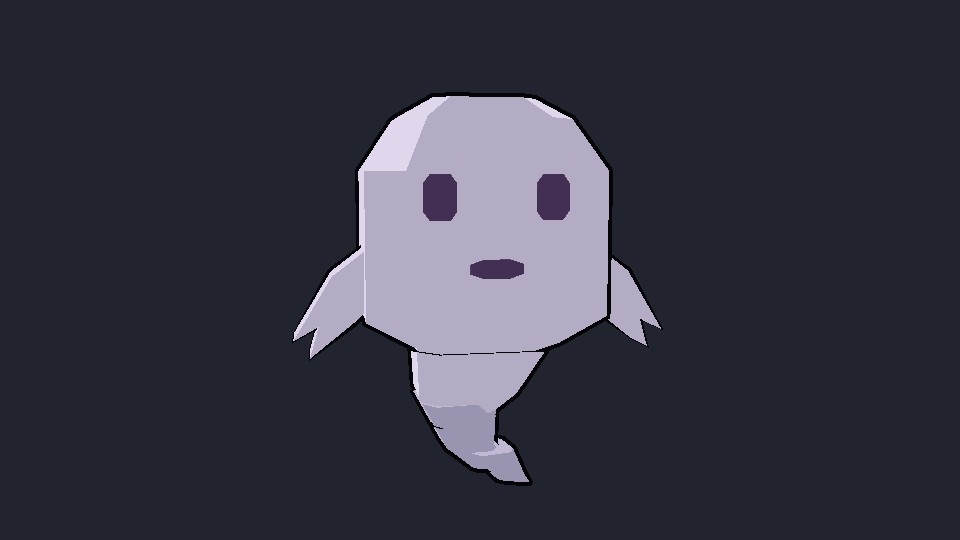
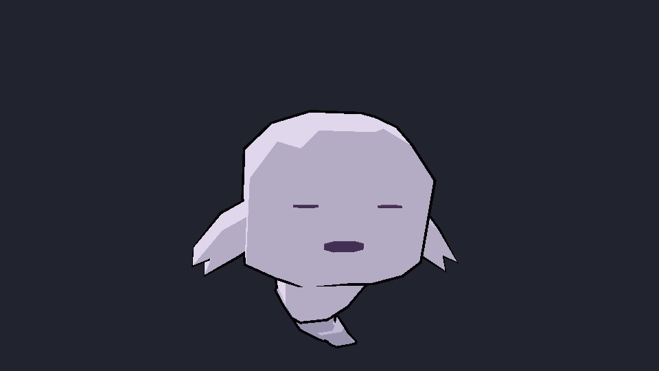
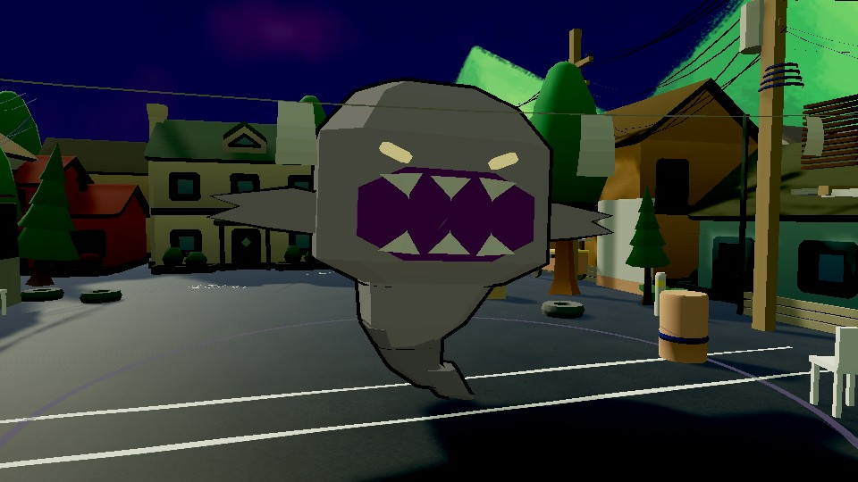

# Kuro: articulated form and personality

The old familiar had one merged mesh. The runtime searched for named mouth, eyes
and tail transforms, so those animations had nothing to move. Kuro now has nine
separate mesh parts, with native Blender source under `MapSource/characters/kuro`.
The persistent Nemu character model is unchanged.





The same familiar grows into a broader, toothed form with inward-slanted eyes and
reaching wisps. Its ground location respects the actual court, including the bridge.
It returns to its original face/materials and expired timeline sampling cannot
revive the transformation. The generic light column, opaque maw and giant implosion
card are replaced by the familiar itself and restrained flow into its real mouth.
The existing pull values have not yet been retuned or fully qualified.

The idle set includes hover, a twirl, double-hop, curious peek, orbit, sleepy snooze,
cheeky giggle and a small pulse. Eye closure, mouth expression and arm wisps accompany
the body/tail motion. Moving and casting take priority. Nemu's emotes receive small
hops and an attentive sway. Fidget randomness is local to each familiar, so cosmetic
idle choices do not change the gameplay random stream.

## Reusing the animation for trailers

Eight named standard Unity `.anim` clips live under
`Assets/TumbangPreso/Art/animations/kuro-idles`. They animate the imported familiar
root and its named children at unit scale; place the actor beneath a parent for
shot positioning/scale. The game uses `CharacterVisual.PersonScale` for its size.
These are assets for animation/Timeline authoring, not a new player mode.

`GhostPetCompanion.PlayIdleGesture` stages one existing gesture while idle.
`SampleIdleForCapture` provides deterministic seeking and refuses to override
possession, devouring or return. Disable procedural ticking when a shot controller
owns the sampling, as `KuroIdleReviewProbe` does. Live follow drift and blending
surround the gesture poses during a match.

After changing the source pose sampler or model hierarchy, regenerate the clips:

```text
python tools/run_unity_guarded.py -batchmode -buildTarget Win64 -executeMethod TumbangPreso.EditorTools.KuroIdleClipAuthor.Build -logFile Logs/kuro-idle-author.log
```

The author keeps every animated sample and reduces only exactly constant channels
to identical endpoints. Tests compare the exported clips against the pose sampler.
The native model can be rebuilt with `tools/author_kuro.py` in Blender; afterward,
refresh the roster using `RosterBookBuilder.Build` if the imported prefab identifier
changes. The actual roster reference is tested, not a substitute preview object.

## Verification and limits

- Full EditMode: 481/481. The three form/idle tests cover real targets, anger
  direction, return, shared-material safety, random isolation, deterministic poses
  and all eight baked clips versus the sampler.
- Personality and real-cast capture: 2/2; corrected form capture: 1/1.
- All eight editor checks and fourteen gating source audits pass. The informational
  audio audit still has seven flags across 119 cues.
- Versioned frames/encoded silent videos: `Logs/kuro-personality-and-form-v4` and
  `Logs/kuro-corrected-form-v5`. The latter has the corrected anger/arm directions.
  The familiar close-up camera hides other bodies only for that art review; owner
  captures retain the ordinary view. These are not multiplayer/overlap approval.

Nemu's remaining functional, sound, possession and pull/counterplay work continues
in the active ledger. No human art, listening or playtest approval is claimed.
