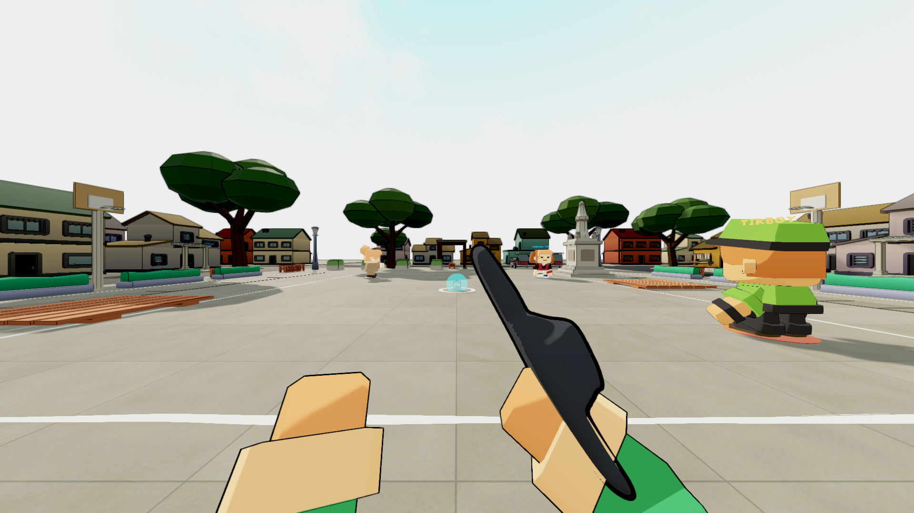
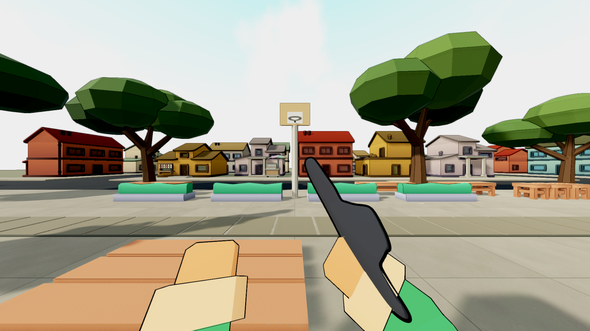
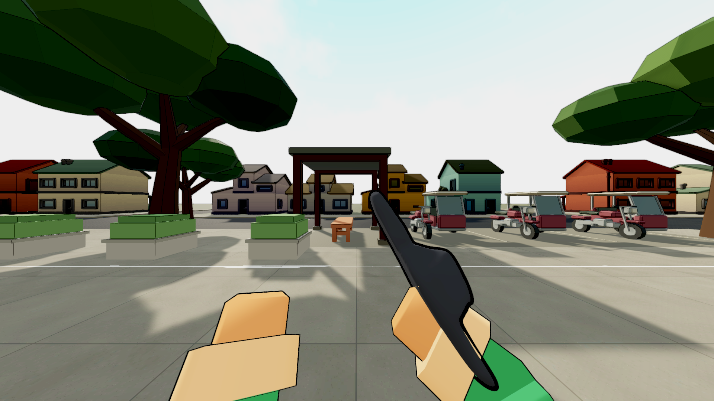
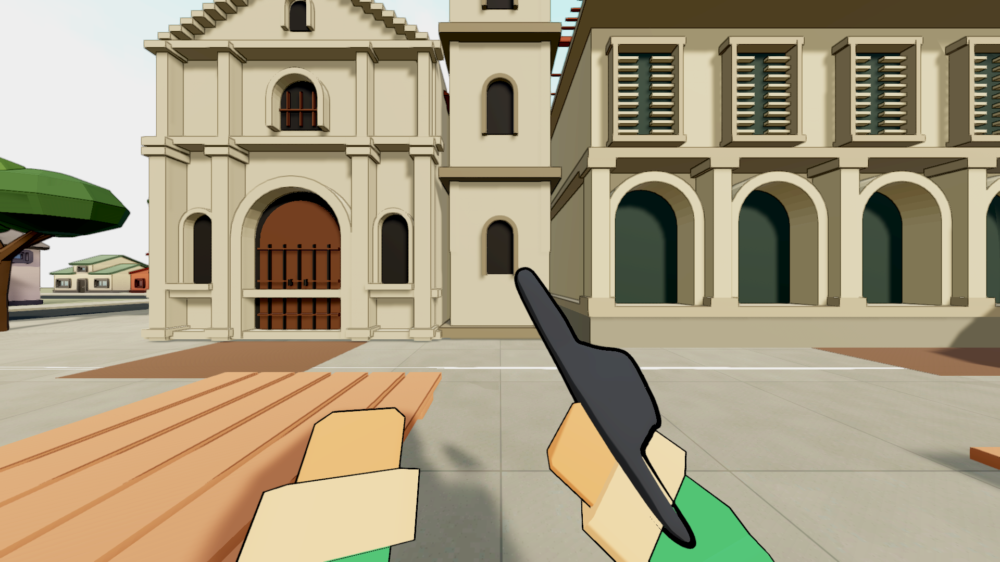

# Bayan civic paving and connected town draft

2026-09-13. Intermediate work on ASTRAReworks after1661cb2b. The larger map/game
improvement goal stays open. No new Windows executable is claimed.

CivicTownAuthor builds original slab paving, four connected streets, forty retained
chunky houses in frontage/back/corner blocks, two recessed original vendor pockets
and garden planting around the existing church, hall, monument and terminal. It
adds closed arched nave windows between buttresses, rear municipal shutters and
service access. The terminal shelter now has substantial posts, feet and beams.
The old distant belt, displaced stalls and conflicting planting remain inactive.

The road is0m, paving.102m, with closed kerb faces and a matching terrain collider.
The old base floor is kept beneath this as a fallback. Terrain lives at the map
root, outside scenery fading, so paving stays visible at the player's feet.
Player boundaries, can/chalk, both modes and core rules remain unchanged.

## Revisions driven by actual criticism

V1 owner views showed readable paving and town depth, but a moved tree pair
intersected basketball backboards. V2 removed that pair. Its district views then
exposed four old fence pieces sitting in the new roads, plus blank civic rear/
side walls. The building-only audit had0 overlaps among43 building footprints;
that was insufficient to approve the props. The fences were retired and civic
side/rear detail was authored. Road-prop candidates are recorded in Logs.

V3's lower road was hidden by the retained floor's.085m render and.1m collision
tops. V4 lowered that fallback and separated the new terrain from scenery fading.
Its actual owner views now show the road and paving correctly. V4 checks then
reported276 retired Slab/Apron pieces on still-active objects; V5 deactivates the
replaced groups while retaining their source data. The checker is unchanged.

## Evidence and limits

- V1 and V4 owner captures each passed1/1 with48 matched real FPP views across
  both modes and3 profiles. These are stills, not ordinary-speed play approval.
- V2/V3 architecture captures each passed1/1,14 witness/district images. V3's
  capture succeeded technically but its road presentation was rejected.
- V4 fresh routes passed1/1:6994 connected nodes across3 maps,7363 clear shoe
  samples,0 unreachable;20/20 actual motor-driven pickups. Bayan itself retained
 2359 connected nodes and2470 clear samples. Other players were isolated.
- V5 checks passed8/8. V5 semantic comparison found a real one-row floor-height toggle because
  Collider.bounds was stale after resetting its transform. V6 derives the top
  from authored box corners. Its second comparison passed19803 rows with zero
  run1-to-run2 differences; baseline differed only by that corrected floor.
- Every run uses run_unity_guarded.py and restores/hash-verifies17 profile files.

The town is more spatially legible, but wider material/lighting coherence, boundary
clarity at open-looking paths, atmosphere, performance and ordinary play remain
part of M10/M11. Eskinita still needs its measured lot/house/parking/corner pass.
Retained-house e/o timber/terrace studies are currently Blender-only preparation,
not map acceptance. Movement/Pektus/equipment, graphics, Sa Bubong and the remaining
kit/network/TODO work remain required.

Sources:map-reference-research.md; MapSource/environment/layouts/bayan-town-plan-v1.json;
tools/author_civic_paving.py; CivicTownAuthor.cs. Original paving uses6m repeats,
1.5m slabs and12mm joints. The generated normal map remains unwired; NearFade's
normal-map material handling is an explicit later graphics task.

## Player-view evidence

Fresh graphical EditMode passed491/491 after the floor-height correction.
The retained base-floor top is derived from local box corners rather than cached
physics bounds. Final checks are being collected before this batch is committed.

A renewed V6 geometry check then found25 support issues:the terrain was only a
surface above the fallback and24 paint objects were tested independently of its
road/pavement levels. V7 closes the terrain skirt/bottom onto the base and makes
markings part of the terrain mesh. No test tolerance or gate was weakened.
Collect current geometry evidence before calling this batch stable.

V7 final geometry checks now pass8/8, with closed terrain and integrated road
markings. Final V7 semantic comparison is running. This keeps the earlier failed
receipts intact and does not equate technical passes with full map acceptance.

Final V7 semantic comparison passed19707 rows (2388 Eskinita,3724 Bayan,13595
Ilalim),with zero baseline/run1/run2 differences. Profile2466329a74f8 restored17.
Final V7 checks passed8/8,profile4406b8074854. Graphical EditMode491/491 passed
on the current code path before the final closed-base/paint-mesh refinement.
The refinement subsequently compiled through author/checks/semantic runs.

Unchanged Eskinita/Ilalim scene ID churn exactly matched the pushed1661cb2b
semantic record and was restored. Arm positions/normals/UVs and all non-vertex
data were verified before restoring generated tangents only. Known Balanced
quality values written into Unity's Ultra slot were exact-diff checked/restored.
No actual Bayan work was discarded. Restoration receipts/backups are in Logs.
