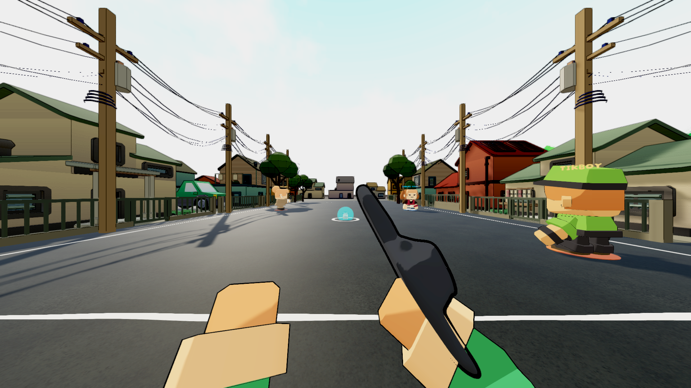
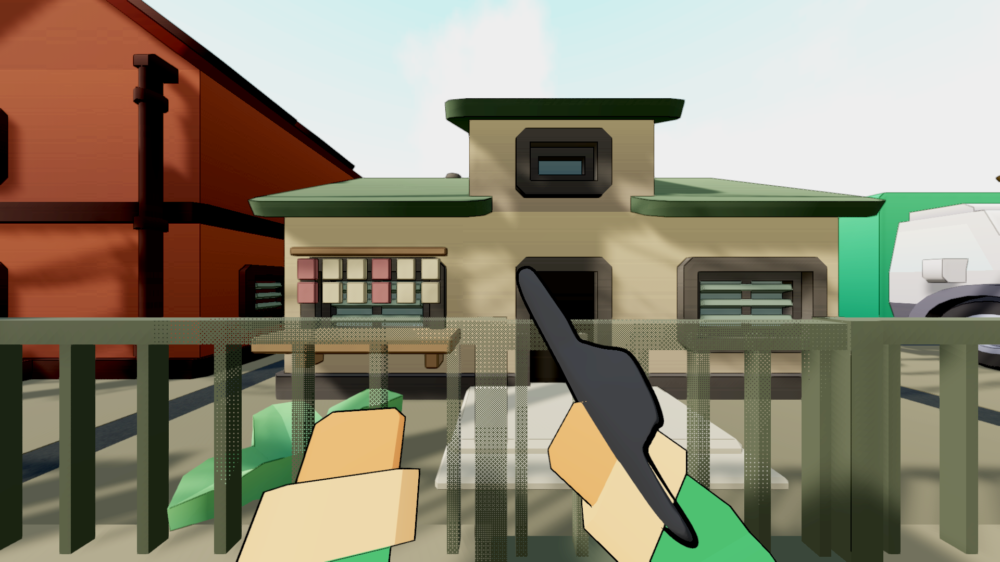
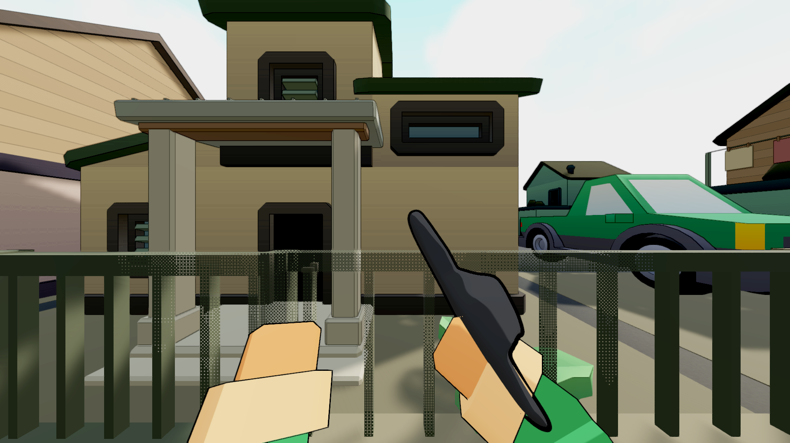

# Eskinita neighborhood draft

2026-09-13,ASTRAReworks after48372a85. Intermediate map work; the wider improvement
scope remains open. No new Windows executable is claimed.

EskinitaNeighborhoodAuthor uses measured house/parking footprints to rebuild ten
homes and four private parking plots, with twenty-six back/corner houses and
connected cross-streets. It retains the old solid body family, deep frames and
roof mass. Near d/j plots use other retained forms because their large fireplace
chimneys did not fit this street. Original source assets/objects remain retained.

Fitted details add jalousies, a service window, supported entrance shade where it
fits, and timber upper finishes on e/o. O preserves its original terrace door,
adds a front window and supported household laundry. An extra new terrace door
was rejected after the Unity oblique review showed the existing one beside it.

Private plot fronts align with existing play boundaries; source car wheels are
seated using whole drawn bounds. Corner shops and their chairs/benches occupy
reserved customer pockets, not the carriageway. Pots belong to house fronts.
Unmatched old atip frames, centre bollards, cross-road laundry and the earlier
mid-street shade additions are retired. The original mountain paintings remain;
the visual base extends beneath their distance while collision remains unchanged.

## Actual criticism and revisions

The first owner views showed stronger houses, but the fences were too uniform and
dominant close up. V2 varied/lowered/lightened masonry and steel fronts and broke
up a mirrored house pair. Wider views exposed old furniture/plants and three
atip-yero frames still in the central road. V3 reassigns or retires those objects.
A building-only audit was not enough: all thirty-eight building/store meshes had
zero AABB overlap candidates, yet that did not prove prop placement.

V3's central-road grounded non-tree renderer audit now has zero candidates, and
the cross-street footprint audit also has zero. The source models remain chunky;
no thin replacement house study is used. Utility-wire aliasing, distant landscape
tone, boundary clarity, atmosphere and complete ordinary play remain in M10.

## Evidence and remaining verification

- V1 real owner capture:1/1,48 matched FPP images across both modes and3 profiles.
- V2 and V3 architecture capture:1/1 each,14 witness/district views each.
- Five-body construction comparison:20 views with unchanged references and
  approved Tikboy. That is construction review, not complete map acceptance.
- Fresh physical routes passed1/1,20/20 pickups across3 maps. Eskinita retained
 2109 connected nodes,2223 clear resting samples,0 unreachable. Other actors were
 isolated. Checks are running; semantic comparison remains due.
- Every Unity launch uses run_unity_guarded.py and restores/hash-verifies17
  profile files. Exact live session/snapshot state is in EXECUTION_PLAN.md.

The map pass does not close movement/Pektus/equipment, graphics scalability,
all-context mashing, approved Sa Bubong, whole kits/alternatives, networking or
exact-player release qualification. Continue the full authorized work.

The first8-check result still treated Eskinita geometry as informational and listed
five car-body/door support rows. Their four wheels were correctly grounded. V4
checks all four wheel contacts/body intersections and annotates only mounted
vehicle parts; wheels retain ordinary geometry checks. Eskinita now joins the
blocking gate,so future findings cannot hide beneath an overall pass.

The strengthened all-map gate now passes8/8 with zero geometry findings. Final
semantic comparison is running; record its actual result before the stable commit.

Final semantic comparison passed21275 rows (3956 Eskinita,3724 Bayan,13595
Ilalim),with zero baseline/run1/run2 differences. Current matched owner capture
is running. No reset or unrelated checkout change was used.

Current V4 matched owner capture passed1/1,48 images,profilec9f1b9d16974.
Graphical EditMode passed491/491,profile40ff882ca74e. Ordinary-speed baselineV2
completed all6 map/mode carry/throw/retrieval sequences,1/1,profile4e19eb6ad113.
The earlier observer view was occluded by a fence and was rejected for body
assessment;V2 uses a court-side offset. Owner/observer MP4s preserve measured
frame timing via tools/encode_motion_review.py. Complete footage/CSV is under
Logs/maps-ordinary-baseline-v2. No runtime animation change is claimed yet.

## Current player views

The portable construction-study O frame retains evidence of the duplicate added
terrace door that was rejected;the final imported V5 removes that extra door.
Do not revive it from the study image.

Before commit,unchanged Bayan/Ilalim scene semantics were matched exactly against
48372a85 and only generated ID churn restored. Arm positions/normals/UVs and all
non-vertex data were verified before restoring tangent-only test additions. The
known five Balanced values written into Unity's Ultra tier were exact-diff checked
and restored. Backups/receipts remain under Logs/eskinita-test-dirt-backup-v4 and
Logs/eskinita-dirt-restored-v4.txt. No actual Eskinita work was discarded.
