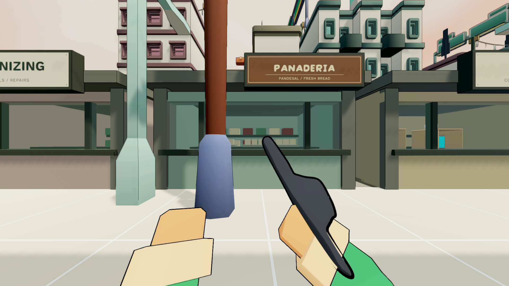
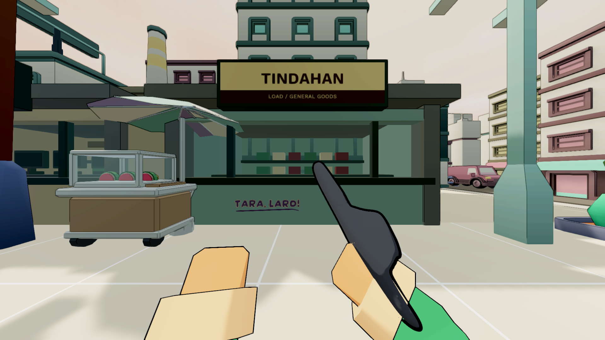
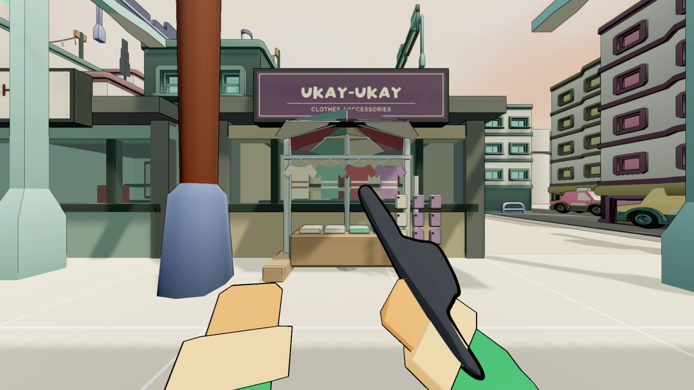
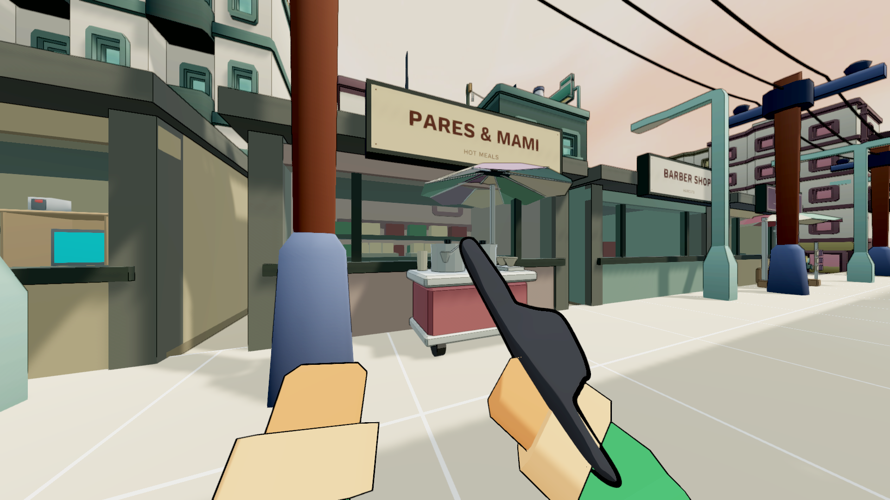
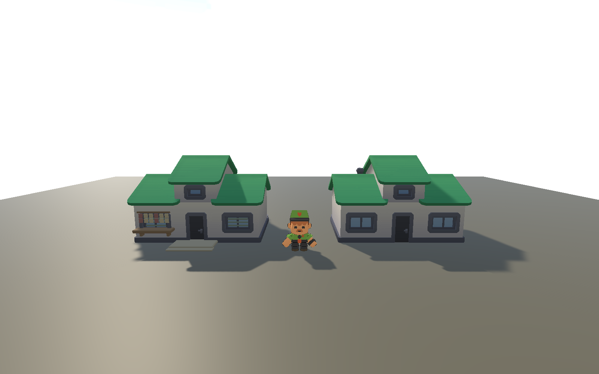
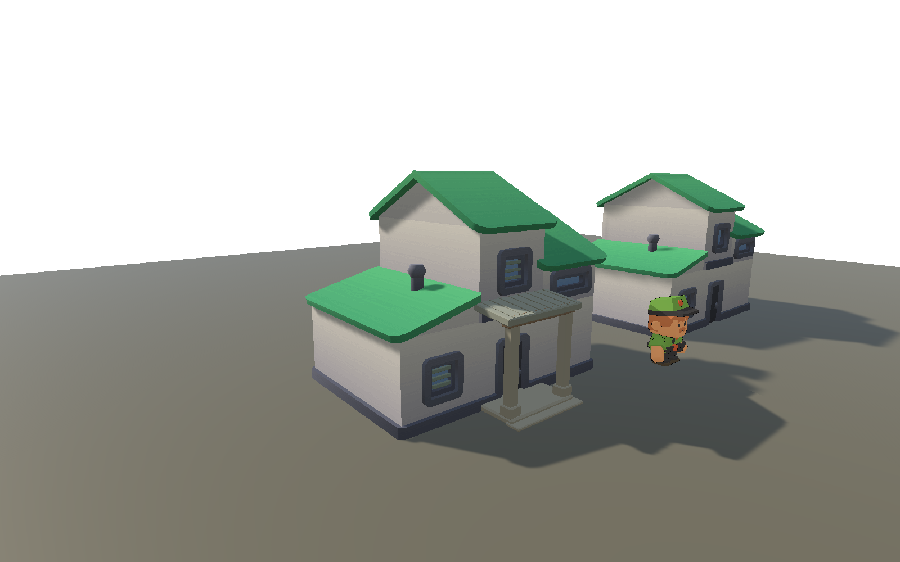

# Ilalim street placement and house construction revision

2026-09-12. ASTRAReworks only. This is an intermediate map batch. The larger
Filipino map transformation, play feel, equipment, graphics, Sa Bubong, kits,
networking and final Windows release are still OPEN under TODO152.4.

## Changes and source ownership

MapPlaceAuthor extends the retained map through MapFinalPassAuthor and
NeighborhoodFinishAuthor. The original chunky commercial bodies remain: eleven
measured frontages now have substantial shop rooms, supported fixtures and stock,
readable signs and two indoor pisonets. Old glyph-heavy sign groups and outdoor
computer placements are inactive. The PC Express logo retains its existing source.

Four original Blender vendor assets provide recognizable activities: frying snacks,
fruit in a glass case, pots/bowls at a pares cart, and shirts/phone accessories.
Each has static mesh collision and a planned frontage pocket. The active street
no longer duplicates them with its previous booth, parked/cargo tricycles, old cart,
delivery boxes, hedge, dumpster or detached street laundry. The original assets
and inactive placements remain available. The tree and planter moved together to
the street-end pavement. No paid generation or photographic pixels were used.

The old crossing ladders and fake trench/loose-manhole decoration are inactive.
New modest crossings face the traffic direction and connect the street ends.
The single optional cord hazard is outside the through-pavement, connected to a
repair-shop outlet. This does not establish the historical48-idle cause.

The owner's bakery/pares screenshots exposed actual intersections. Twenty-eight
existing utility poles now occupy a separate pavement strip atabsX9.80, with
mesh collision;78 thin conductor spans are regenerated after their placement.
Signs fit clear spans beside shafts instead of always centering on the storefront.
Old roof attachments move with their building; roof laundry is fitted and supported.

Sign artwork has restrained varied layouts and one original Tara Laro wall painting.
The poles use their retained source timber/metal texture with a subdued neutral
material tint, replacing the decorative pink/yellow bands from the commercial atlas.
The first untinted source-material view was too orange under the actual sun and
was revised. Proper names, gameplay chalk and existing jeepney livery are preserved.

## Rejected work and critical assessment

The owner rejected the thin V1-V5 replacement houses. They were never placed in
maps. Zero serialized GUID references were found before moving those untracked
studies, their sources and old author to Logs/rejected-thin-house-studies.

New house details fit the retained city houses a/c: existing deep frames, solid
bodies and roof silhouettes stay intact. Jalousies, a small service window and a
supported entrance shade are new. The low-house canopy in detail V1 covered its
transom and was rejected; V2 omits it. The construction bench compares unchanged
originals, detailed versions and approved Tikboy in8 views. These detail sets are
NOT in maps and need reserved setbacks and actual in-map evaluation.

Ilalim remains too repetitive in its room arrangement and broad facade surfaces.
The new stalls and stock improve use/readability, but do not finish architectural
identity or the wider city. Full side/back/roof review, ordinary-speed play with
all actors, material/lighting balance and performance still require work. The
owner's requested Bayan paving/connected town and Eskinita housing pass are next.
Do not treat importing models or passing tests as artistic acceptance.

## Evidence, with scope

- NearFade alpha correction is separately pushed at0611c6d4. Its two new cases
  failed before; full focused suite13/13 passed after. Fresh runtime glazing
  diagnostic confirmed transparent interiors. See near-fade-alpha.md.
- V3 frontages:1/1,22 real owner views,10 broadphase sign/roof-pole pairs with no
  physical penetration. V6 renewed the22 views and clearance,1/1 again.
- V4 routes:6994/6994 connected nodes,7363 clear resting samples,0 unreachable,
 20/20 actual motor-driven pickups including every vendor and a utility pole.
  Other actors were isolated; this is map geometry, not live AI balance.
- V4 checks caught23 support findings. Slabs were6-7cm above the scenery ground;
  they now reach it. Monitors and chairs are complete material-grouped meshes
  with their actual supports. V5 checks passed8/8 without weakening the checker.
- V5 semantic comparison:2388 Eskinita,3135 Bayan,13588 Ilalim rows,19111 total;
  zero baseline-to-run1 and run1-to-run2 drift after save/reopen. Eskinita/Bayan
  rows also exactly match the pushed V9 semantic record.
- V5 matched owner capture:48 real FPP images across both modes and3 profiles,
 1/1. Real camera1.25m/95degrees. Still images do not prove ordinary-speed feel.
- Fresh Core562/562 and14/14 gating source audits pass;7 informational audio
  flags remain. Full graphical EditMode491/491 passed. Final V7 frontage/clearance1/1 passed,
 22 owner images; the muted source timber material was inspected in the actual scene.
 Final V7 semantic comparison passed19118 rows with zero baseline/run1/run2
 drift (2388 Eskinita,3135 Bayan,13595 Ilalim). Every required result has nonzero
 coverage. These are intermediate batch checks, not full release qualification.

All runs use tools/run_unity_guarded.py and restore/hash-verify17 existing profile
files. Exact sessions/snapshots/live state are in EXECUTION_PLAN.md. No new Windows
player has been built or represented by the older Desktop/internal executables.

## Sources and pending next work

- Research:map-reference-research.md; source observations and owner images are
  distinguished from design proposals. Ilalim remains the Gilmore/LRT setting.
- Layout:MapSource/environment/layouts/ilalim-place-plan-v1.json.
- Vendors:tools/author_street_stalls.py; MapSource/environment/street-stalls.
- Signs:tools/author_street_signs.py; MapSource/environment/signs.
- House details:tools/author_retained_house_details.py; native studies include
  the existing licensed Kenney reference, while exported detail meshes are new.
- M08 prep:tools/author_civic_paving.py and bayan-town-plan-v1.json. Original
  paving under Logs/civic-paving-v2 is not imported/applied yet. Roads/corners,
  planting, kiosks and civic entrances must be composed together before approval.

## Portable review frames

Construction comparison only, no map placement:

V7 final profile snapshots:authorfd3224687022,EditModec1b827143f2b,
frontage7f554fb352a4,semanticc65efd3d553b. All17 existing files restored each time.
Unchanged Eskinita/Bayan scene ID churn was restored after exact semantic equality
with the pushed V9 record. Test-generated arm changes were verified byte-for-byte
on positions/normals/UVs and all non-vertex data, then tangent-only additions were
restored. Whitespace-only material dirt was similarly verified. Backups and the
restoration receipt remain under Logs/map-test-dirt-backup-v7 and
Logs/map-test-dirt-restored-v7.txt.
