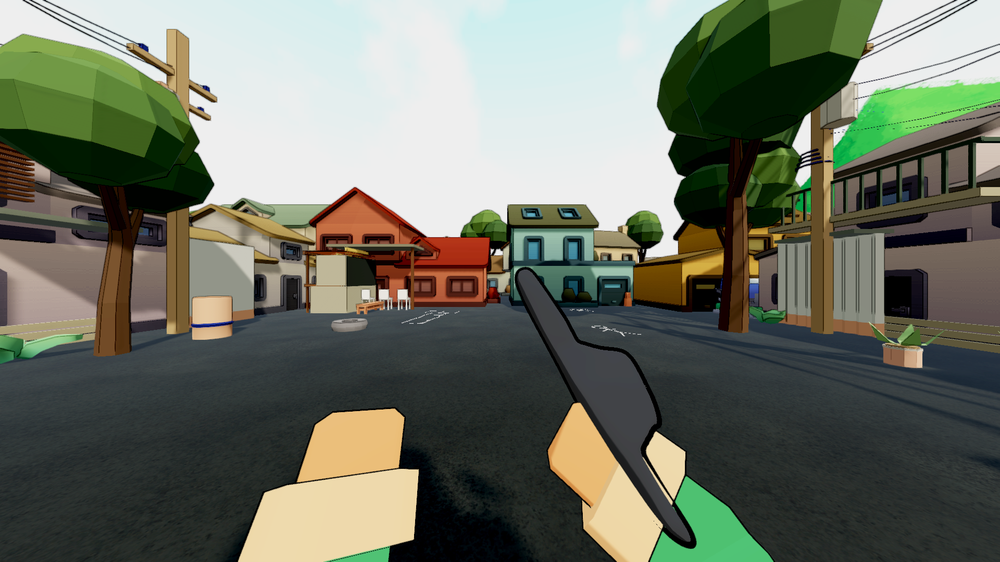
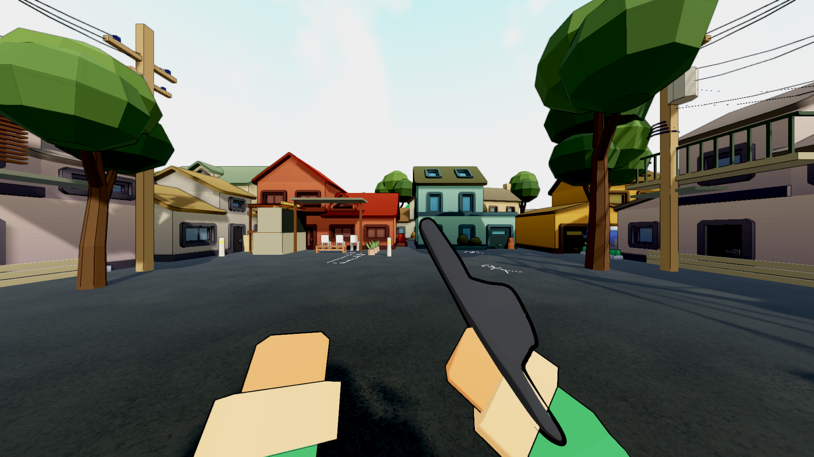
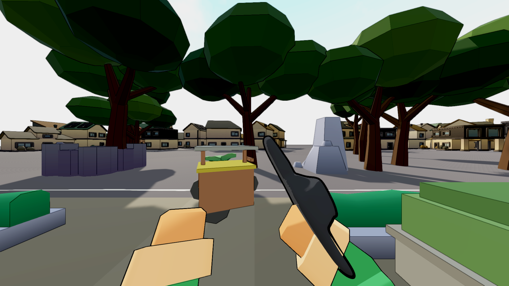
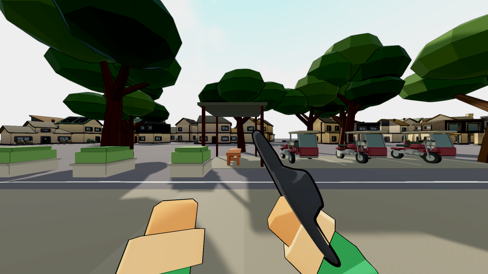
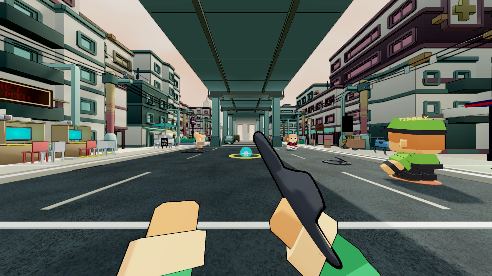
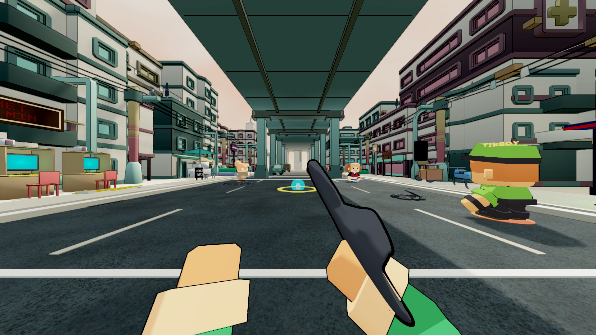

# Map composition through the real first-person rig

Baseline source:8a22f8b9. The retained map architecture, original broadleaf models,
approved people and imported shop/jeepney livery remain. This continues the partial
map pass; full ordinary-play and release qualification are not implied.

## What changed

The legal owner views exposed non-solid props that the earlier seating-only pass
had left in retrieval space. MapFinalPassAuthor now groups24 selected pieces in
Eskinita,16 in Bayan and18 in Ilalim at the physical map perimeter. These include
tin-can planters, tyres, small plants, drums, bollards, loose corrugated panels,
hedges/fences and Ilalim's non-solid chairs/crates. Existing objects with colliders
retain their physical role. Excess art remains inactive rather than deleted:
17/10/4 pieces respectively. Retained sourced artwork and saved IDs are preserved. Bayan adds one original
passenger-tricycle model for its terminal; the older six props remain inactive.

Eskinita's plants frame the two street-end seating/shop pockets; tyres/drums read
as stored roadside goods. Bayan's garden borders and benches now sit beyond the
play wall, with open retrieval space in front. Ilalim keeps its interactive
electronics/food edges and actual pillars/carts, with loose decoration at pavement
ends. Placement uses the actual drawn base, accounting for imported pivot offsets.

The southern Bayan edge now has three spaced motorcycle/sidecar tricycles, quiet
parking marks and a separate shaded waiting bench. Tree trunks are behind the
parking bay. The new model has608 source vertices,544 faces and7 material groups;
its native source/author live under MapSource/environment/terminal and tools.
Four existing box planters and four lanterns frame the perimeter. Extra ghost
railings, unrelated boulders and a placeholder flagpole are retained inactive.
Hoops now face inward from opposing east/west sides, clear of the church/hall
frontage, with short brackets connecting their hoops to their backboards.

Eskinita's imported benches now run across the street-end shade rather than into
the shop queue. Chairs leave a customer aisle and four crate stacks have separate
positions; the earlier recipe placed two stacks on top of one another per side.
All furniture placement accounts for actual rendered bounds, not imported pivots.

The three retained Eskinita mountain paintings are placed farther away at a smaller
apparent size, with their original image aspect and no texture/material edits.
Two accidental colliders on distant picture quads are removed. Native broadleaf
tree replacement counts and reachable trunk collision remain33/29/1 trees and7
trunks across the maps.

## Comparable owner evidence

MapExperienceProbe uses the live CameraRig and viewmodel, not a witness camera.
Its body locations remain inside physical walls, and other stationary seats are
staged at least1.5m away. Eight directions per map, both modes and all three
quality profiles produce144 comparisons at1920x1080. All144 camera metadata rows
match exactly between baseline and final: position, eye height, yaw,95-degree FOV
and selected quality. The eye offset is1.25m above the body.

Static views pause game time to compare the same scene state. They are not a
normal-speed action review. Baseline:Logs/map-owner-baseline-v2. Final:Logs/map-owner-composition-v9,
fresh NUnit1/1 with144 matched views plus6 scene-load frames. All24 Balanced
Classic directions were reviewed in the contact sheets below. Hero Strike and
Low/High images are also captured, with full effects/graphics qualification open.

| Map | Before | After |
|---|---|---|
| Eskinita |  |  |
| Bayan Plaza |  |  |
| Ilalim ng Tulay |  |  |

Direction sheets: [Eskinita](map-composition-images-v9/Eskinita-directions.jpg),
[Bayan](map-composition-images-v9/BayanPlaza-directions.jpg),
[Ilalim](map-composition-images-v9/IlalimNgTulay-directions.jpg).
The V5 images remain as historical iteration evidence.

Six separate16-second controlled carry/charge/release/retrieval sequences also
complete at1x in Logs/map-owner-motion-v3 (1/1 test, all6 map/mode rows). Both owner
and body recordings are encoded using their real timestamps, without interpolated
frames or arbitrary FPS. These precede this non-solid dressing relocation and are
motion/input evidence, not final map or built-player qualification.

## Corrections the evidence required

- The original fixed north station intersected another parked player's head;
 24/144 frames were over80% black. The local body was correctly ShadowsOnly.
 Separating seats restores the view. No runtime self-hide/shader change was made.
- A coroutine-written pickup edge could be committed by motor FixedUpdate before
 Carrier.Update saw it. The test now supplies input at Update order-300, matching
 the real input phase. No runtime input change was made to repair this fixture.
- The first distant quad placement faced away and the first side hedges were
 rotated across the benches. The next capture corrected their orientations.
 The painting has22% transparent space at the top, so its world height was then
 adjusted to keep the actual peaks visible above the roofs.

## Route and repeatability evidence

V5 route evidence: MapRouteProbe passed1/1 with18 actual motor-driven pickups
around representative walls/trunks/monument/kiosks/carts/pillars. All7047 walkable
nodes were connected;7420 clear resting samples had reachable approaches. Other
actors were disabled for map geometry isolation, so this does not establish live
AI/opponent avoidance. CSVs:map-route-grid-v5.csv and map-route-pickups-v5.csv.

V9 semantic comparison passed across2388 Eskinita,3135 Bayan and11223 Ilalim rows:
zero baseline-to-run1 or run1-to-run2 differences after saving and reopening.
The V5 comparison previously failed on duplicate sibling enumeration and floating
point drift from relative bound placement. Stable sibling sorting and placement
from a fixed origin corrected the author; the checker was not loosened.
See [the full V9 receipt](map-repeatability-composition-v9.txt).

All14 gating source audits pass; the informational audio check still flags7 files.
V9 editor checks pass8/8; fresh graphical EditMode passes489/489. Renewed
MapRouteProbe passes1/1 with the same7047 connected walkable nodes,7420 clear
resting samples and18/18 actual motor-driven pickups.
[Grid](map-route-grid-v9.csv), [pickups](map-route-pickups-v9.csv).
All17 existing profile files were restored and hash-verified after every run.
Test-generated tangent-only changes to24 arm meshes were byte-checked against
the original position/normal/UV streams and restored; test-written quality
settings were restored too.

## Still required

 Historical48-idle attribution, wider free play, side/back landmark
review where useful, active-effect overlap, the full isolated gate and exact Windows
player remain open. These captures are not owner taste or human playtest approval.
