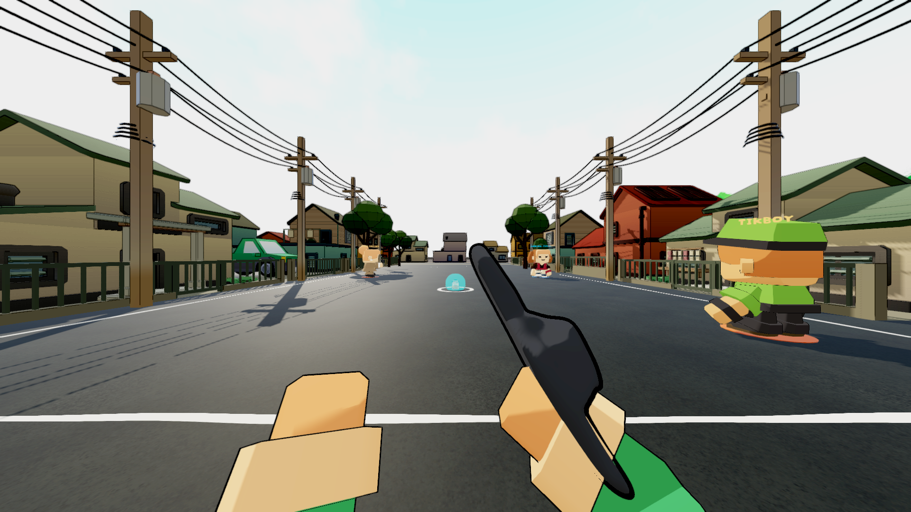

# Eskinita utility coherence pass

The retained pole OBJ embedded8 longitudinal6m wire spans and used saturated dark
blue wire material. Actual owner views showed broken-looking thin lines and poor
separation. The derived pole retains its hardware/coils but separates span authoring
from pole geometry. Five named insulator anchors now connect50 round44mm strands
across the12 placed posts. Crossarms face across the street and wire material is
neutral dark. Narrow trunk collision is measured from source base vertices.

The old source files and original scene instances are preserved. An initial
namespace compile error was corrected; it is not a passing verification receipt.
Fresh matched owner capture passed1/1 with48 views across both modes/3profiles.
Low/Balanced images show visibly cleaner continuous wires. Physical routes passed20/20,all8 editor checks/14source audits passed,and21467
semantic rows stayed identical across baseline and two saved/reopened author runs. No GPU/performance improvement is
claimed without measurement, and the larger graphics/game scope remains open.

Evidence:Logs/eskinita-utility-v1-owner (48matched actualFPP views),
Logs/eskinita-utility-v1-routes.xml (1/1),grid.csv/routes.csv (20pickups/0unreachable),
Logs/eskinita-utility-v1-semantic/report.txt (4148/3724/13595rows),
Logs/eskinita-utility-v1-checks.log and-audits.txt. All17profile files restored:
owner cdb0be60d3f6,routes ab9333807a1b,semantic315dedca3d3e,checks4bf49ba06ac4.

Self-critique: cleaner continuous neutral strands fit the retained chunky hardware;
wire anchoring is now explicit rather than overlapping baked spans. Wide house-row
repetition,landscape tone,boundary clarity and full lighting/performance evaluation
remain. Current pictures are evidence for this narrow revision,not an assertion
that the full map/game aesthetic is complete or owner-approved.

