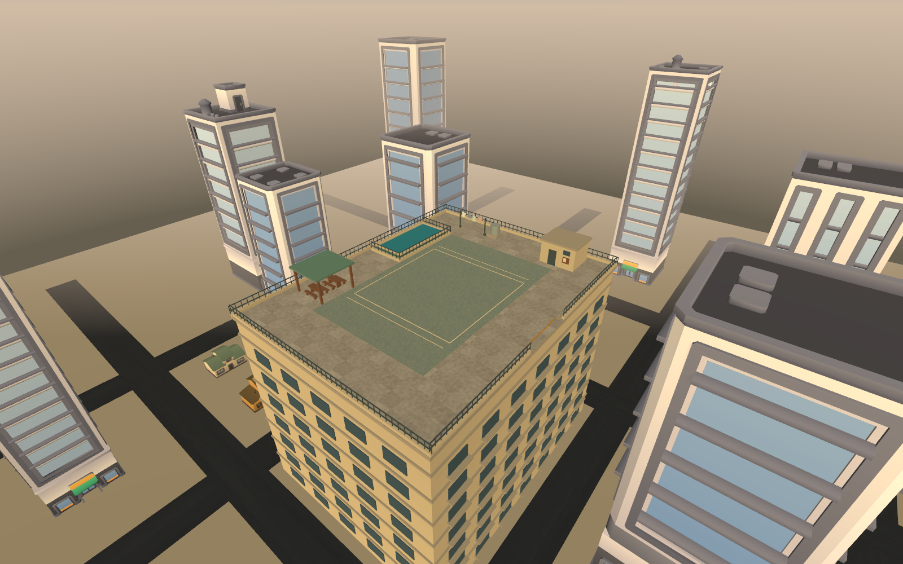

# Sa Bubong, recovery input and resident laundry

This batch follows9ff95072 on ASTRAReworks. The broader improvement goal remains
open. The map has a playable implementation and verified primary recovery loop;
this is not final art, all-network or whole-game release qualification.

## Map and play

Sa Bubong is a condo roofdeck: a clear central recreation court, fenced pool,
resident tables/shade, stairhead, water tank, laundry corner and a city below.
The painted court and afternoon light distinguish it from Bayan's civic paving.
The initial sparse box skyline was revised using five existing commercial tower
families at measured uniform scales, with retained lower houses and streets.

The east opening reaches the actual slab edge. Crossing it produces a real fall;
a descent latch prevents steering back under the slab from bypassing recovery.
After falling, the player returns prone to their safe spawn and uses the existing
jump/mash control to rise. A held slipper is released. A slipper lost off the deck
or stranded in the fenced pool stays unavailable for10seconds, then returns to
reachable ground. Inactive stock cannot accept a delayed grab. Round reset cancels
old deadlines so they cannot disarm newly assigned equipment.

Host owns falls and return timing. Existing snapshots carry inactive stock and
separate trip/stun state. Protocol30 prevents older peers selecting the wrong map
and supports the clarified independent timer semantics. Other maps' GroundY,
raised-ground and inaccessible-roof recovery were not rewritten.

## Recovery faults reproduced and corrected

1. Quick touch down/up vanished before the physics consumer. A real TouchButton
   and PlayerInputReader reproduction observed0presses. Jump now retains one press
   until consumed, without retaining a held state or making repeats. Chat discards
   queued recovery input. Keyboard/gamepad use the existing configured reader.
2. Trip mash subtracted from an independent4s tag, making it3.78s. Trip and normal
   stun now retain separate clocks; either blocks action/movement. Trip recovery
   and prediction never spend tag/element time. Physical roof falls still require
   a get-up during ordinary stun immunity. Existing ordinary trip immunity remains.
3. Direct network launch loaded Sa on the host without publishing SelectedMap.
   SyncMap sent clients to Eskinita, whose bounds then clamped their player. Map
   adoption now precedes transport startup, and client load follows authoritative
   selection. Destroyed actors encountered during that unwanted reload are ignored
   by the central player lookup.
4. Repeated can snapshots replayed UprightChanged and kept LATA IS BACK UP on the
   HUD. Notifications now fire only on a true transition. Defense scoring at10per
   second is the existing rule and was not retuned.
5. The objective hint no longer asks an empty-handed rooftop player to retrieve
   when all loose alternatives are unavailable: it says SLIPPER RETURNING. Reset
   copy uses the actual Grab binding rather than a stale hard-coded E.

## Original laundry and placement critique

Original Blender shirts, shorts, towels, pegs and a sagging line are authored by
`tools/author_resident_laundry.py`, with native sources under
`MapSource/environment/resident-laundry`. LaundryMotion billows the lower fabric
while its upper vertices remain pinned.

The first imported placement was wrong: handedness conversion sent the model
along negativeX while the posts assumed positiveX. Actual mesh measurements exposed
an18m line running into Eskinita's back lots. Placement now orients from geometry
and fits supports to measured endpoints; all three placement regressions pass.
The low courtyard line crossed a porch awning and was removed from Eskinita.
Its redesigned street line is15.5m at source, fitted to the existing utility
trunks below conductors. It is now visible from the main approach without blocking
players. Sa retains the4.4m freestanding resident line with fitted end posts.

## Verification evidence

- Core562/562 after the diagnostic modifier addition.
- FullEdit516/516 after map/registry/placement/guard changes; latest subsequent
  pose/author changes receive final gates separately.
- RecoveryDeviceProbe5/5:63trip/element/device/requested-cadence combinations,
  quick taps versus holds, independent tags and delayed-snapshot prediction.
  Devices are synthetic keyboard/gamepad through the actual configured action
  asset/reader, and actual touch-button callbacks. Requested30/60/144cadences have
  observed frame timing logged. This does not certify physical handset hardware.
- RooftopRecoveryProbe3/3 initially: real edge descent,10s stock/actual pickup in
  both modes, pool recovery, inactive-grab refusal, reset and pinned cloth motion.
  The later objective snapshot transition test passes separately1/1.
- NemuKitContractProbe33/33 after the timer changes.
- Sa two-run saved authoring comparison:0changed rows across1649compared rows
  before the final laundry placement refinement; fresh repeatability is queued.
- Eskinita final corrected laundry FPP1/1:48matched views plus2HUD images in both
  modes and all3presets, Logs/eskinita-laundry-fpp-v3.

## Genuine separate-process evidence

Buildv2: protocol30,9ff95072+dirty,built2026-09-13 11:58:41. RuntimeDLL SHA256:
`dda2c764d68630269c3784202a98f03fbb8b367caa2cd0e26c796ba34b2a3f27`.
Classic v2 passes on host/owner/observer:10accepted presses,3.89-3.91s down (the
fixture deliberately waits2s before mashing),10.027-10.035s slipper loss, and
subsequent pickup on all peers. Hero150ms one-way delay + observer rejoin also
passes:10presses,4.17-4.27s down,10.019-10.046s shoe loss. That rejoin observed114
unavailable samples but0trip samples; it arrived after the get-up.

Buildv4: protocol30,9ff95072+dirty,built2026-09-13 12:22:41. RuntimeDLL SHA256:
`b771a18b36d6682da76e585fd77d523dfaad20a9cd742d8ebb7827c559ba76ff`.
Classic capture v2 passes with217owner and231observer images. Hero delay/rejoin
with a concurrent4s tag verifies10presses,9.995-10.016s shoe loss,and the independent
tag lasting3.97-4.09s. The rejoin sees80unavailable and2trip samples. Owner has199
continuous captured frames; observer has27before termination and180after rejoin.
Those observer segments are NOT a continuous clip across the offline gap.

Raw data/results: Logs/roof-network-classic-v2,
roof-network-hero-delay-rejoin-v1,roof-network-classic-capture-v2,
roof-network-hero-overlap-capture-v1. The last folder's result-reviewed.json fixes
only the evaluator's treatment of intentionally split observer capture, using
unchanged raw data; the original failed result.json remains.

The first ScreenCapture attempt wrote0images in batch mode. That receipt is
explicitly capture-failed. The replacement renders the actual player camera to
HDR, resolves sRGB and composites an ungraded HUD, restoring render state. The
runner checks recorded files exist. MP4s use measured real-time spacing.

All player processes use isolated named probe profiles; the main player profile
was not restored over or reset. Their manifests are on disk. Every Editor uses
run_unity_guarded with the separate owner-review-editor profile.

## Final support review for this checkpoint

Sa Bubong now participates in the same geometry gate as the other three maps.
Its floor check requires the roof, not the city ground26m below. Exterior fall
space is deliberately excluded from floor samples; real descent is separately
proved by the recovery fixture/network captures. The first gate failed34resting
checks. Building bases were30mm above ground; separately rendered furniture tops
and wall details also needed inspection of their physical joins. Skyline bases
now sit1mm above the ground; bench legs meet seats, mounted backs meet walls, and
shade/stairhead are baked supported assemblies with their colliders retained.
Tolerances were not relaxed. All4maps now have0resting/void/court findings, and all
8editor checks pass after the corrections. Two saved rooftop rebuilds have0changed
rows across1597rows. The CLI evaluation's response timed out, but the Editor
completed its reports and all4review images before exiting; receipt is retained.

[Portable checks](roofdeck-recovery/checks.txt),
[geometry](roofdeck-recovery/geometry.txt),
[repeatability](roofdeck-recovery/repeatability.txt),
[test counts](roofdeck-recovery/test-results.json) and
[artifact hashes](roofdeck-recovery/artifact-manifest.json).

Self-critique: the deck's uses and ledge are readable, but the surrounding towers
remain too evenly distributed and empty ground lots make the city feel artificial.
The roof needs more considered resident details and the pool surface is too static.
This is a stable playable foundation, not accepted final art. Fix these while
continuing the remaining tree/atmosphere/map review. Original stock tree comparison
also confirms most alternatives are conifers or narrow capsules; new broadleaf
silhouette work is next. Do not call the map pass finished from green checks.

The owner withdrew the Desktop update request on2026-09-13. Keep developing;
Desktop remains the olderd9c0314b build. After maps, ANIMATIONS AND SKILLS are next
together, including effects and Tekken/Genshin-like signature ultimate moments
within TUMP's approved style. No new approval is pending.

## Still open

Tree variety across maps, further rooftop/city composition and visual finish,
round/rematch/host-loss/owner-rejoin coverage, richer environmental and movement
animation, measured graphics scalability and final exact-player release gates.
After maps the owner prioritizes full ability mechanics/implementation/visual
revamps and distinct signature ultimate moments, across all six kits and their
alternatives. The original18people and accepted Kuro direction remain intact.
No cause is claimed for the historical Ilalim48-idle outlier.
