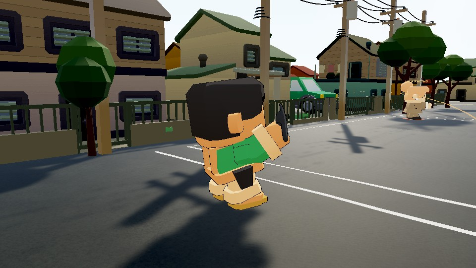
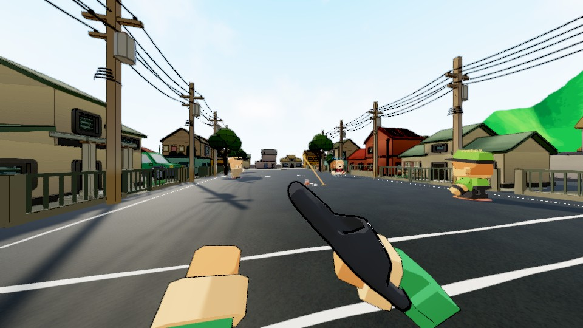
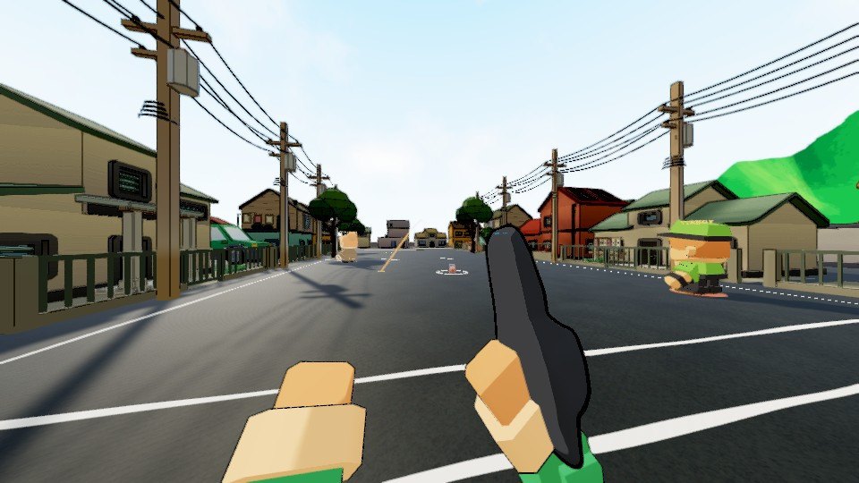

# Throw, Pektus and handover improvement

The retained18 people now show a backward coil,balancing off-hand and directional
arm roll while charging. Straight,left and right Pektus releases transfer forward
and settle. FPP starts its release immediately instead of cocking back again after
the shoe has left;the elbow/grip solve keeps the shoe at arm's length and the
forearm connected to the screen edge. Legs continue during moving throw actions.
No people geometry,controls,aim spread or trajectory/balance values were changed.

Protocol29 carries charge phase and signedspin to the listenhost,other players and
rejoining observers. The host previously forwarded a client's windup without
applying it locally. Owners retain their live input;remote phase does not restart
at zero when spin changes. Updates are bounded to10Hz whilechanging and2Hz steady.

The actual-process review also isolated orphaned warmup equipment: a bot could
pick shoe0,then getshoe1 at the whistle while parkedshoe0 still claimed its hand.
Repeated snapshots re-equipped that ghost after the realthrow. Forced replacement
now disarms/seats the displaced shoe;parking disarms beforedeactivation;normal
grabs reject occupied hands;inactive snapshots cannot occupy one. Newdrop uses
narrow support below the holder while preserving raised ground and existing roof
recovery. PublicGroundY and actualflightquery/trajectory are unchanged.

## Verification

- Core562/562. FullEdit504/504 for motion/handover,including18rigbody preparation,
  3grip cases,3signedrelease/cancel cases at30/60/144Hz and5handover contracts.
- Carried-anchor5/5;directrelease/under-guideway/raisedsupport/unreachableroof4/4.
  All8current editorchecks and14source audits pass.
- SixTimeScale1 owner/observer throw sequences,bothmodes,in
  Logs/throw-motion-v4-ordinary. All12MP4s encoded from actualframe timestamps.
- Actual3process Classic strictwarmupcase passes. Actual3process HeroStrike with
 150msone-waydelay and observerrejoin passes. Both require foreignshoe0pickup AND
 disarm beforewhistle. Every signedphase is visible on allpeers;0post-release
 ghostheld samples. Rejoined observer has159activecorrect samples.
- Portable correctedCSV/results:throw-network-classic-v4 and
 throw-network-hero-delay-rejoin-v4 beside this report. Failingearliercases and
 fullreasoning remain in throw-motion-investigation-history.md and siblingfolders.

The internalplayer is Builds/ThrowReview/TumbangPreso.exe,buildV5,base50e07025 plus
thisdirty implementation. RuntimeDLLSHA256:
307167a3a54ebb1f9ec44db7799bd14cad46321cf98b906c76b2fbf60bf2189c.
UnitylauncherEXESHA256:
6f44fe53090dad3edd9f86f5b5691b2cc8cba07deb4efd4791d7e32135385cb8.
The runtime/data hash matters;the Unitylauncher hash stays unchanged betweenbuilds.
This is an internal verificationartifact,not the final game release. Desktop is older.
Protocol28 players cannotjoin protocol29;Android remains unqualified.

## Critique and remaining scope

V1 evidence sampled beforeLateUpdate and was rejected. Later revisions corrected
bodyhandlowering,FPP eye/downward clipping and a disconnected-looking forearm.
V4 fits the retained blocky limbs and keeps directional intent readable. It is
not full humanfeel approval or complete animationcoverage. Broader angles/all18
people in ordinaryplay,carrying/sprint/backward/turn cadence,foot support,aim-control
and equipment tradeoffs remain. Actualmotorroot settles0.08m above road support;
measure the drawn feet before changing physics/alignment. Maplighting/boundary/
performance,graphicssettings,SaBubong,wholekits and network/release scope stay open.
Historical48idle penalties remain unattributed;do not link them to this handover
without evidence. Standalone current6seed results are a separate report.

