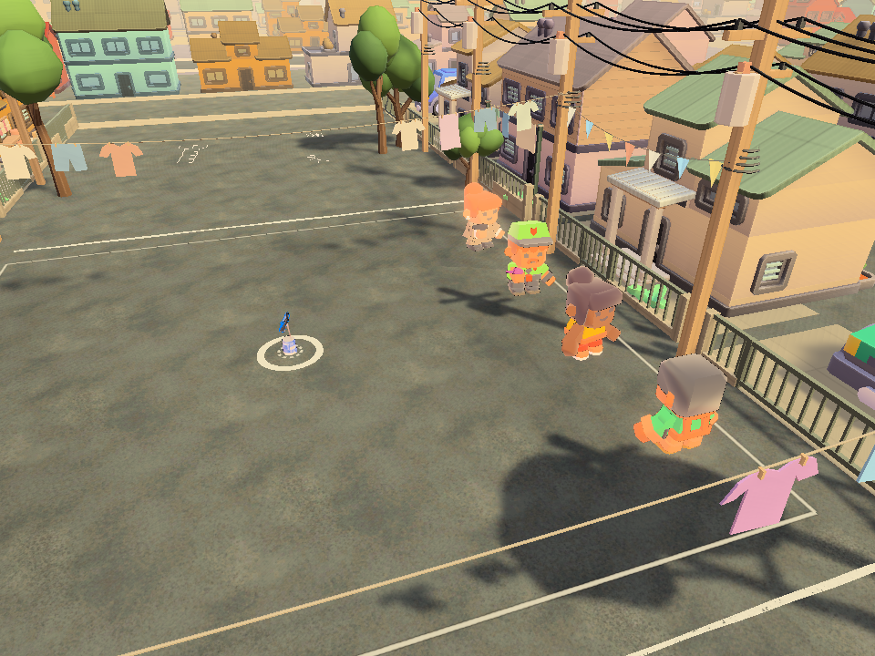
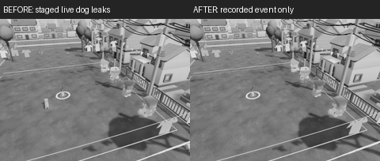

# Ambient replay isolation and can replacement, 2026-09-24

Current animals were visible inside recorded past events. AmbientLife's private
activity/flight schedules are live-only; the archive has player, slipper, can and
familiar tracks, not animal history. Both retained replay and victim catch cameras
now hide the live AmbientLife renderers for their synchronous render and restore
the previous flags immediately afterward. Live simulation, models, routes and
normal-camera visibility are unchanged. No replay format or network change.

The existing retained-exchange test and a short catch test reproduced both leaks
before the fix: **0/2 passed**, both failed at the new ambient-isolation assertion.
The actual replay-camera callbacks inspect the real animal renderers, including
one renderer already hidden before playback. The retained case also checks that
the live animal transform is unchanged. No component/GameObject disabling is used
by production code.

The first post-fix run passed catch isolation and the retained-camera assertions,
then exposed a separate genuine lifecycle error in the existing can replacement
scenario: Lata.RestoreRaisePresentation wrote to the old destroyed mesh. It now
invalidates that cached transform and pose, then resolves the replacement Visual
subtree. This also avoids choosing an effect mesh ahead of the new can art. The
authored raise/clunk motion and authoritative can transform are retained.

Final native graphics run: **2/2 passed in 13.0930289 seconds**, guarded Unity,
Direct3D 11, source d98e592ae plus the changes in this batch. It preserves the
original retained-clip assertions for real can contact, round retention, can art
replacement, pose binding, detached non-simulating copies and match reset.
`before.xml`, `after-can-cache-failure.xml` and `after.xml` preserve the progression.
No test assertion was weakened and no fixture repair was needed.

## Actual visual comparison

An existing dog was deliberately placed near the can to expose the timing leak.
This is a staged visibility witness, not an ordinary dog route or a new animation.
The same replay camera shows that present-time dog before the fix and only the
recorded event afterward. Both captures and exact 25 percent greyscale thumbnails
were inspected. Normal-speed ambient behavior retains its separate per-map evidence.

## Limits and next action

This does not add animal recordings, prove every map's continuous replay playback,
or replace real-peer/current-player qualification. It resolves the shared camera
isolation defect using existing renderer restoration. Ambient pause already uses
scaled delta time and has separate local checks. Continue the remaining queue;
do not rerun these two passing cases until relevant source changes or final P7.

Raw logs and generated-churn backups remain in the qualification workspace's Logs.
Unity finished and the known generated churn was restored. No helper/browser was
opened for this unit.
