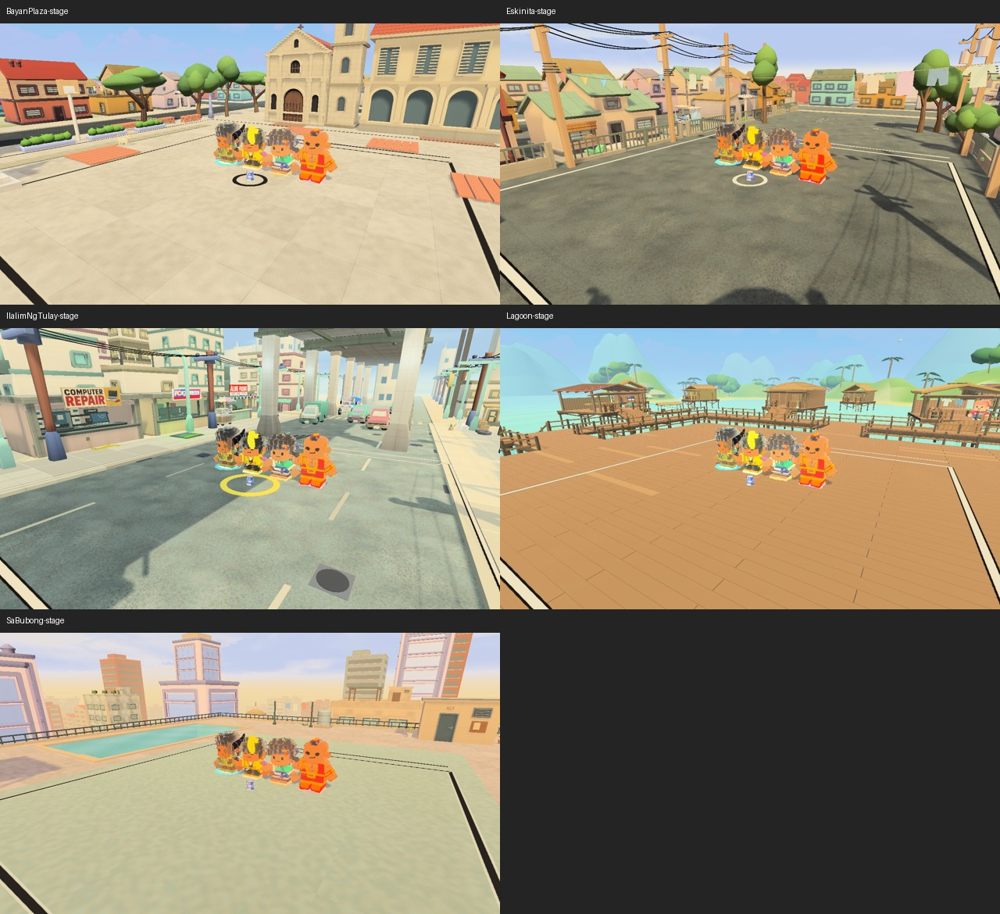
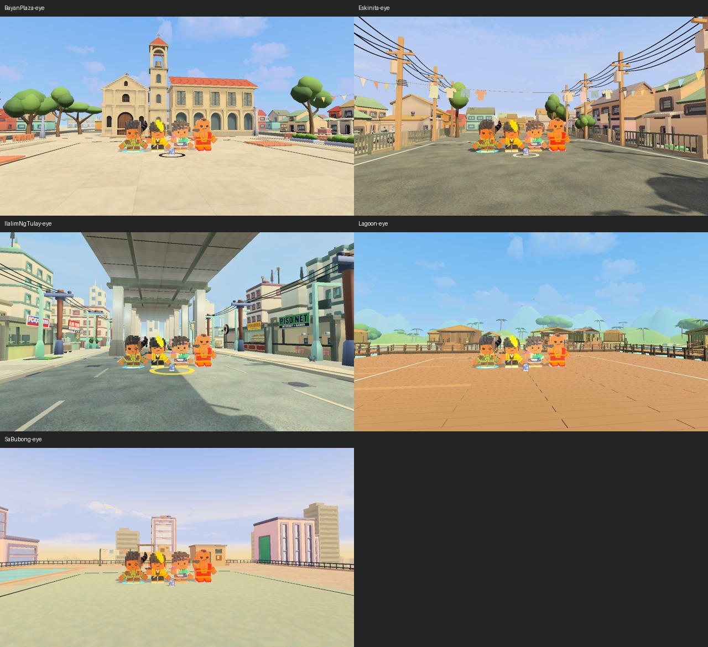
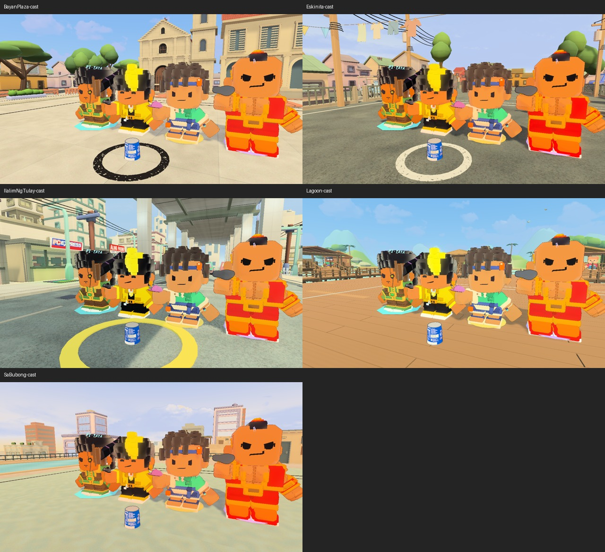
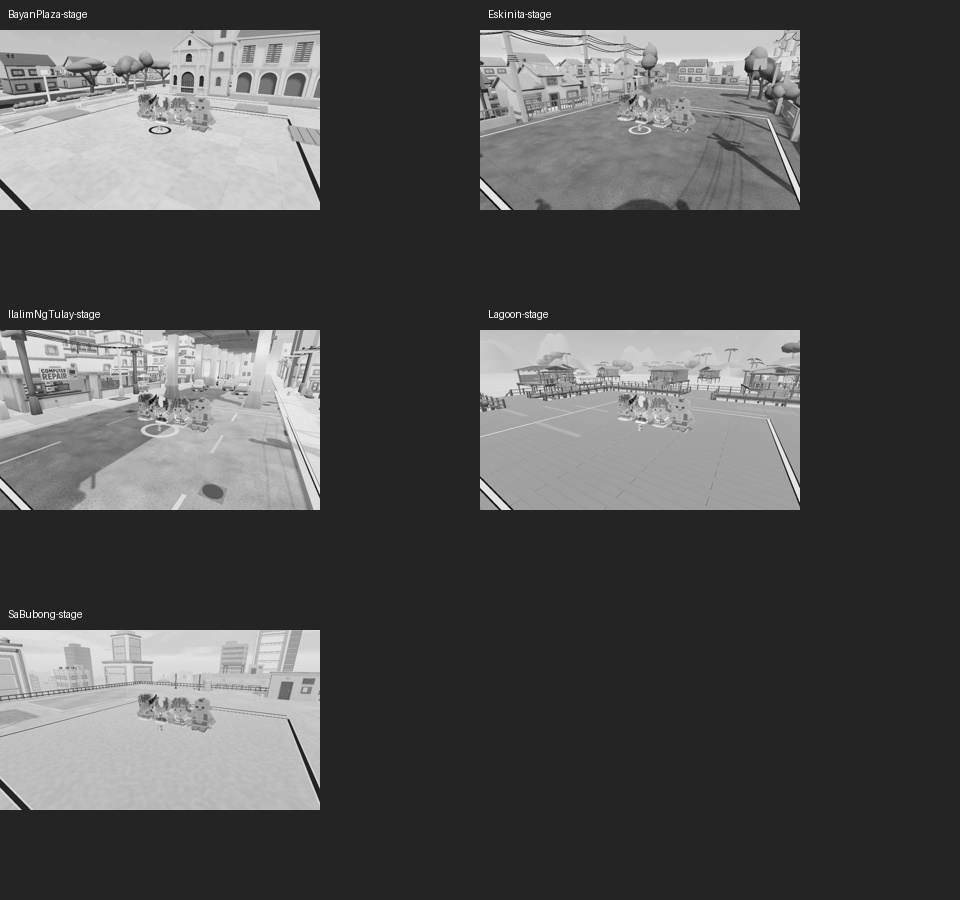

# Windows renderer compatibility, 2026-09-24

The original accessibility-v57 player reproduced its exit crash under Direct3D 12
and exited cleanly under Direct3D 11 on this machine. Windows builds now explicitly
prefer Direct3D 11, with Direct3D 12 retained second. This is a compatibility
mitigation, not proof of an internal engine or driver root cause.

## Exact comparison

The original internal build was copied unchanged, not rebuilt. `binary.json`
records its source and executable, engine and runtime assembly hashes. Both runs
used the existing protected accessibility review route, separate isolated profiles
and the same executable on AMD Radeon RX 6600, driver 32.0.21043.19003.

- Direct3D 12, level 12.2: all 15 review stages passed; exit 3221225477
  (`0xC0000005`) after `CodeReloadManager destroyed`. Windows event 1000 identifies
  D3D12Core.dll 1.618.1.0 at offset `0xa1f5`. That offset differs from the historical
  `0x264831` note. The full matching event and bounded log excerpt are retained.
- Direct3D 11, level 11.1: the same 15 stages passed, exit 0. Both actual backends
  were verified in logs. Both runner receipts report shared input unchanged.

No Unity upgrade, driver change, account change or Desktop build was involved.
The original v57 build remains untouched. No current-player pass is inferred from
this old binary comparison, and one successful exit does not prove every GPU stable.

## Authored change and current-source check

`GameBuilder.PreferCompatibleWindowsRenderer` used Unity's PlayerSettings API to
disable automatic Windows API selection and save the order Direct3D11, Direct3D12.
The serialized diff changes only the Windows graphics API entry. Other platforms,
shader settings, lighting and quality remain unchanged. The authoring receipt is
`renderer-preference.txt`. The native review runner's optional `--graphics-api`
argument supports future bounded diagnosis without changing its protected profile
behavior. Unity documents that the first available API in the ordered list is used
when automatic selection is disabled:
[SetGraphicsAPIs](https://docs.unity.com/en-us/engine/6000.5/script-reference/unityeditor/playersettings/setgraphicsapis).

Current source `45aa55558` plus these renderer changes passed the existing
`BrightLookSameCameraCapturesOnAllFiveMaps` case, **1/1 in 43.5834526 seconds**, using
guarded Unity with `-force-d3d11`. The log confirms Direct3D 11, not just the flag.
Actual stage, eye-level and cast views were inspected for all five maps, along
with the 25 percent greyscale stage thumbnails. Buildings, sky, water, court
surfaces and cast rendered; no missing/pink materials or black output were seen.
These are staged Editor captures, not an API image-equivalence/performance test
or a native player review. There was no same-current-build D3D12 comparison.

## Remaining gate and cleanup

P7 must build the frozen current candidate, verify that it actually selects
Direct3D 11 by default, run its native route and check clean shutdown/performance.
Keep the native shutdown TODO open until that current-binary gate is met. Do not
repeat the historical pair or create another intermediate build for reassurance.
No game, Unity Editor or Unity crash-handler processes remained after these runs.
Generated run churn was backed up before restoration; raw logs remain in the
qualification workspace. The comparison used one pair and one current-source
compatibility case, without a soak or fixture-repair loop.
