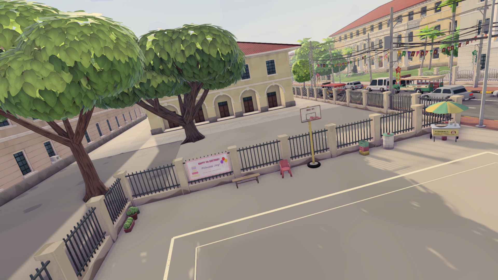
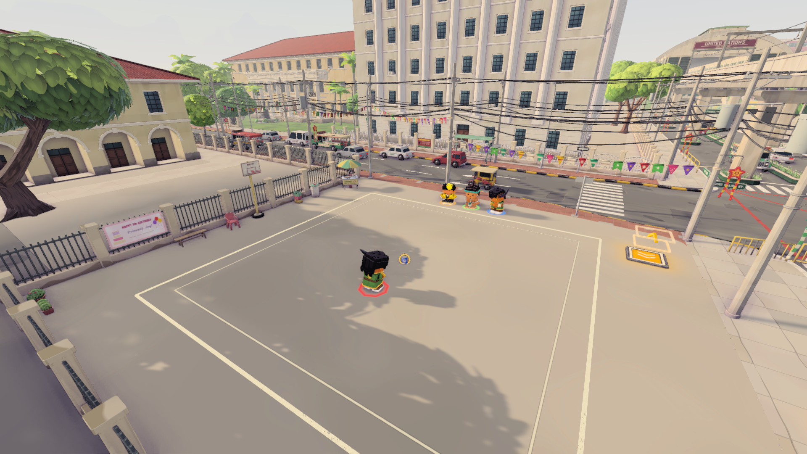
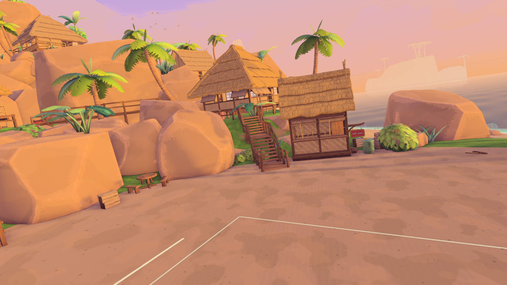
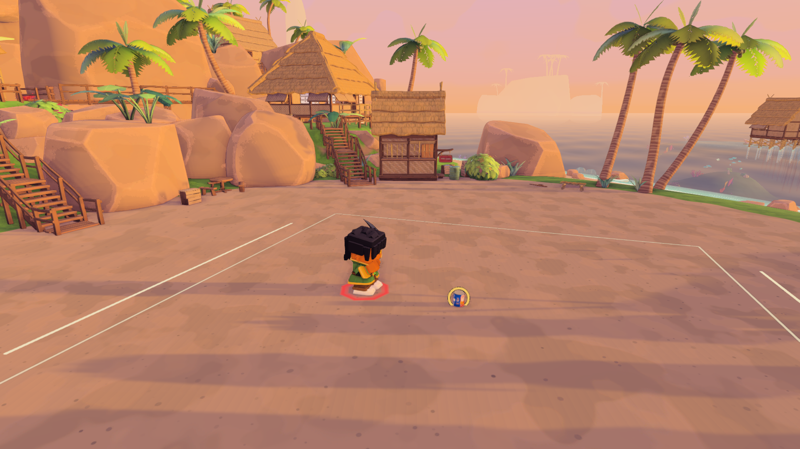
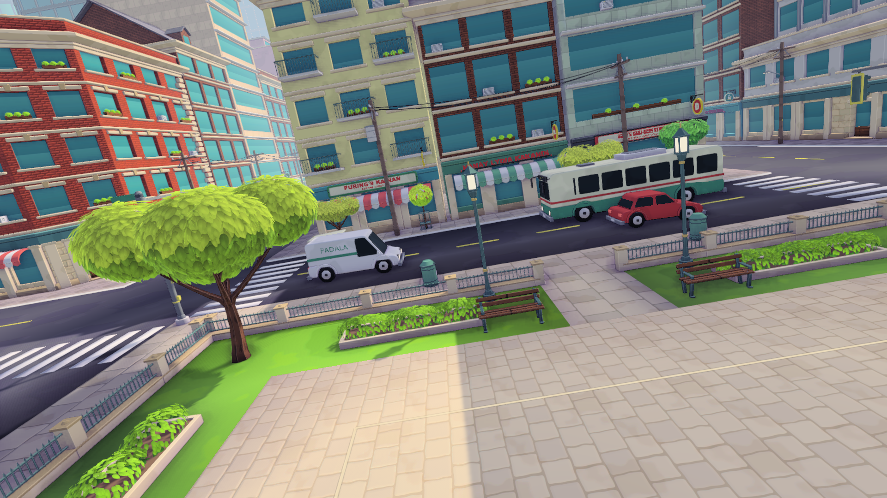
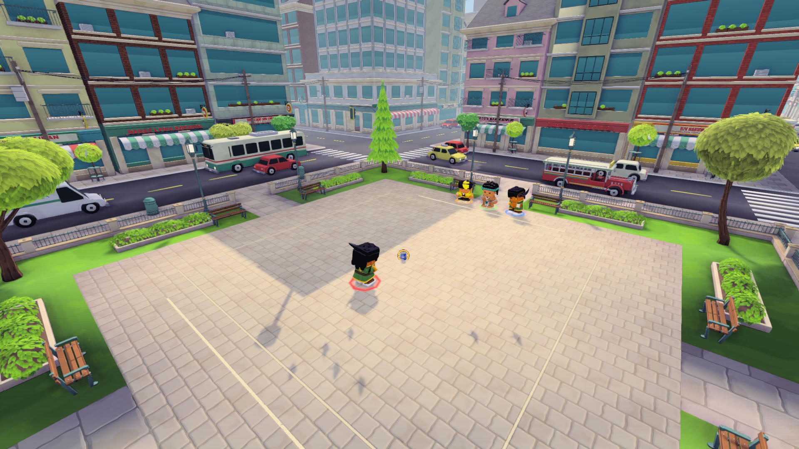

# Keep the cast visible while returning to gameplay

The three new-map openings moved the camera through the look target while
interpolating opposing portrait and gameplay rotations. Bridge, Cove and Kanto
briefly showed empty scenery with a banked view. The return now follows an
upright horizontal arc around a smoothly changing look target, checks world
clearance and reaches the exact stored gameplay pose before rig ownership
returns. Old-map presentation and authored hero content are unchanged.

The original natural runs pass seven controls and fail the three ordinary
all-bot openings. Bridge loses every projected player/can subject for 96 frames,
Cove for 109 and Kanto for 113. Their banked-frame counts are 176, 201 and 205.
The candidate passes all ten controls with zero empty or banked frames across
2,623 observed handoff frames. Normal player-camera ownership, reduced motion
and disabled camera motion remain covered.

Post-fix native capture passes all three natural openings. Fresh 1920×1080
camera renders use an asserted 16:9 lens; the hidden batch GameView itself
remains 640×480. Independent review confirms Cove keeps the taya and can visible
and Kanto keeps all four players and the can visible without foreground
obstruction. Bridge also retains the court subjects through the orbit. All
return to the stored whole-court view. The can partly overlaps the taya at that
inherited endpoint.

Bridge, original then corrected:

Cove, original then corrected:

Kanto, original then corrected:

The first capture fixture used unsupported WaitForEndOfFrame in batch mode.
Its replacement used the late-frame observer but initially stretched a default
4:3 camera lens into a widescreen image. Both attempts remain retained locally;
only the explicitly corrected 16:9 captures support these comparisons.

[Evidence](evidence.json) verifies five exact tested source files and 42 raw
native/visual receipts. Original50808, candidate49576 and post-fix capture47708
plus their preservation/restoration workers are terminal. All 21,385 protected
inputs and shared preferences restored exactly after each run.

These are world-camera and geometry checks. Screen-overlay captions, continuous
motion feel, broader portrait composition and current player frame pacing remain
separate acceptance work. The Desktop725e release remains unchanged.
