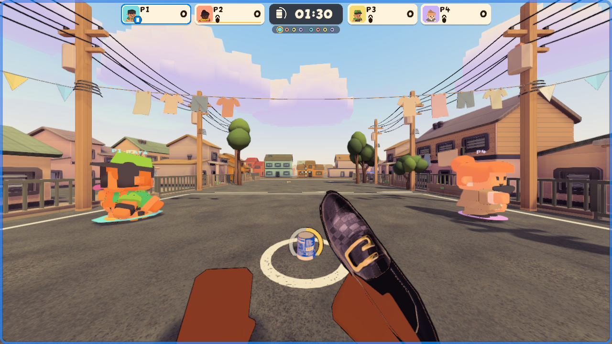
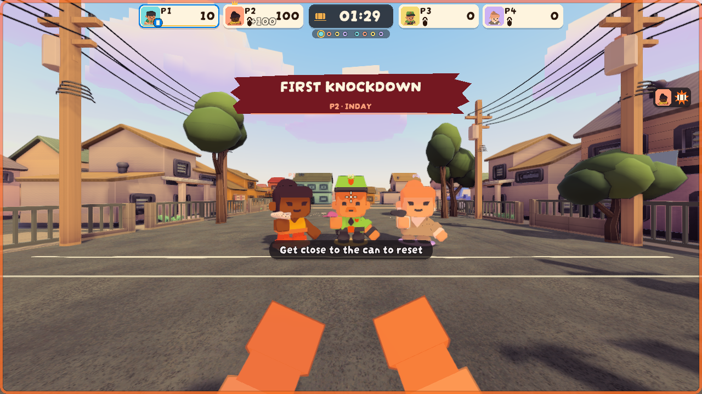

# Taya can-down frame, 2026-09-30

Owner playtest note: the taya did not notice when the can was knocked down. The
knockdown usually lands behind a chasing taya, and the taya's cues were a small
edge can icon and the bottom prompt. The local taya now gets the VISUAL-1.1
screen-edge frame and onset cue in Offense orange while the can is down, held
until the can stands again. Design: [NATIONALS_POLISH 1.2](../../NATIONALS_POLISH.md).

## Evidence

Candidate `2bacb97c` plus the change committed as `e2265054`, frozen in an
isolated worktree with a copied Library. Guarded PlayMode, `-force-d3d11`,
profile `taya-frame-20260930`, Eskinita, Classic.

| Case | Result |
|---|---|
| `TumpNativeHudTests.ArmedAttackerInsideTheBoxSeesTheDefenseFrame` | Passed |
| `TumpNativeHudTests.TayaWhoseCanIsDownSeesTheOffenseFrameUntilTheReset` | Passed |

Fresh XML: total 2, passed 2, failed 0. The first run passed too; its attacker
render was blocked by the taya's body, so the staging moved nearby actors aside
and the pair was run once more. Input hashes (sha256, first 12): TumpHudEffects
`fd45e3591090`, HudDangerFrame `291f9bcdb375`, TumpNativeHudTests `79f5c9018aec`.

| Armed attacker inside the box | Taya, can knocked down behind them |
|---|---|
|  |  |

The taya's case is the real round-one taya seat, not an attacker with the flag
flipped, so no tsinelas is in hand. Both renders are the held state after the
0.36 s onset cue. The edge can marker is its own canvas and the capture helper
does not draw it; the run logged it live for the taya (`visible=True state=DOWN`).

Not covered: actual peers, the onset timing at normal speed, and human review of
whether the frame is noticed mid-chase.
